## 도메인 모델

### 선행 구현 사항

#### 라운드 생성 및 활성 상태

- `POST /api/rounds`(라운드 시작) 시 `investment_round.status = ACTIVE`로 저장된다.
- 사용자당 ACTIVE 라운드는 1개만 허용한다.

#### 조회 포트 현황

- `InvestmentRoundQueryPort.findActiveRoundByUserId(userId)`가 이미 존재한다.
- 현재 포트 DTO(`InvestmentRoundInfo`)는 `roundId`, `userId`만 제공한다.
- `rules`까지 응답하기 위해 `InvestmentRoundInfo`를 라운드 상세 조회 필드를 포함하도록 확장한다.

## 포트/어댑터 책임

| 컴포넌트 | 책임 | 비고 |
|----------|------|------|
| `GetActiveRoundUseCase` | 활성 라운드 조회 유스케이스 | 신규 |
| `InvestmentRoundQueryPort` | 활성 라운드 조회 | 기존 |
| `InvestmentRuleQueryPort` | 라운드 규칙 목록 조회 | 기존 |
| `FindWalletUseCase` | 라운드별 지갑 목록 조회 (크로스 컨텍스트) | 기존 |

## 시퀀스 다이어그램

```mermaid
sequenceDiagram
    participant Client
    participant Controller as RoundController
    participant Service as GetActiveRoundService
    participant RoundAdapter as InvestmentRoundQueryAdapter
    participant RuleAdapter as InvestmentRuleQueryAdapter
    participant WalletUseCase as FindWalletUseCase
    participant MySQL

    Client->>Controller: GET /api/rounds/active?userId=1
    Controller->>Service: getActiveRound(query)

    rect rgb(60, 60, 60)
        Note over Service,MySQL: STEP 01 활성 라운드 조회
    end
    Service->>RoundAdapter: findActiveRoundByUserId(userId)
    RoundAdapter->>MySQL: SELECT investment_round WHERE user_id=? AND status='ACTIVE'
    RoundAdapter-->>Service: round

    rect rgb(60, 60, 60)
        Note over Service,MySQL: STEP 02 투자 원칙 조회
    end
    Service->>RuleAdapter: findByRoundId(roundId)
    RuleAdapter->>MySQL: SELECT investment_rule WHERE round_id=?
    RuleAdapter-->>Service: rules

    rect rgb(60, 60, 60)
        Note over Service,WalletUseCase: STEP 03 지갑 목록 조회 (크로스 컨텍스트)
    end
    Service->>WalletUseCase: findByRoundId(roundId)
    WalletUseCase-->>Service: List<WalletResult>

    Service-->>Controller: GetActiveRoundResult
    Controller-->>Client: 200 OK
```



## task 목록

- [ ] `InvestmentRoundInfo` 포트 DTO를 라운드 상세 필드(`rules` 포함)까지 확장
- [ ] 활성 라운드 조회 UseCase와 서비스 구현(userId 기준 ACTIVE 1건 조회)
- [ ] 투자 원칙 목록 조회 연동(round_id 기준, 없으면 빈 배열)
- [ ] 라운드별 지갑 목록 조회 연동(크로스 컨텍스트)
- [ ] 활성 라운드 조회 REST 어댑터와 응답 DTO

## API 명세

`GET /api/rounds/active`

### 참고사항

- 현행 라운드 API 패턴에 맞춰 인증 컨텍스트 대신 `userId`를 요청 파라미터로 받는다.
- `status`, `code`, `message`, `data` 형태의 `ApiResponseDto<T>`를 사용한다.

### Request Query

| 필드 | 타입 | 필수 | 설명 |
|------|------|------|------|
| userId | Long | O | 사용자 ID |

### Request

```http
GET /api/rounds/active?userId=1
```

### Response

```json
{
  "status": 200,
  "code": "OK",
  "message": "활성 라운드를 조회했습니다.",
  "data": {
    "roundId": 1,
    "userId": 1,
    "roundNumber": 3,
    "status": "ACTIVE",
    "initialSeed": 8000100,
    "emergencyFundingLimit": 500000,
    "emergencyChargeCount": 2,
    "startedAt": "2026-02-27T14:30:00",
    "endedAt": null,
    "rules": [
      { "ruleId": 11, "ruleType": "LOSS_CUT", "thresholdValue": 10 },
      { "ruleId": 12, "ruleType": "PROFIT_TAKE", "thresholdValue": 25 }
    ],
    "wallets": [
      { "walletId": 1, "exchangeId": 1 },
      { "walletId": 2, "exchangeId": 2 },
      { "walletId": 3, "exchangeId": 3 }
    ]
  }
}
```

### 에러 응답

| code | status | 설명 |
|------|--------|------|
| ROUND_NOT_ACTIVE | 404 | 진행 중인 라운드가 없음 |
