## 도메인 모델

### InvestmentRound (수정)

- `ACTIVE` → `ENDED` 상태 전이를 담당하고 `endedAt`을 서버 현재 시각으로 기록한다.
- 이미 `ENDED`면 멱등 처리하고, `BANKRUPT`는 종료 대상이 아니다.
- `@Version` 낙관적 잠금으로 동시 종료 요청 충돌을 검출한다.

## 포트/어댑터 책임

| 컴포넌트 | 책임 | 비고 |
|----------|------|------|
| `EndRoundUseCase` | 라운드 종료 유스케이스 | 신규 |
| `InvestmentRoundPersistencePort` | 라운드 조회/저장(상태 전이) | 기존 확장 |

## task 목록

- [ ] InvestmentRound 도메인에 종료 상태 전이(`ACTIVE` → `ENDED`, `endedAt` 기록) 추가
- [ ] 이미 `ENDED`인 라운드의 멱등 성공 처리와 `BANKRUPT` 종료 거부 처리
- [ ] `@Version` 낙관적 잠금 기반 동시 종료 충돌 검출 및 `CONCURRENT_MODIFICATION` 매핑
- [ ] 종료 UseCase와 서비스 구현(라운드 조회·소유권 검증·상태 전이·저장)
- [ ] `InvestmentRoundPersistencePort` 조회/저장 확장
- [ ] `ROUND_NOT_FOUND`, `ROUND_ACCESS_DENIED`를 `ErrorCode`와 `messages.properties`에 반영
- [ ] 종료 REST 어댑터와 요청/응답 DTO

## API 명세

`POST /api/rounds/{roundId}/end`

### 참고사항

- 현행 패턴에 맞춰 `userId`를 요청 바디로 받는다.
- 재요청(이미 종료된 라운드)은 200 성공으로 처리하고 기존 종료 정보를 반환한다.

### Path Parameter

| 필드 | 타입 | 필수 | 설명 |
|------|------|------|------|
| roundId | Long | O | 라운드 ID |

### Request Body

| 필드 | 타입 | 필수 | 설명 |
|------|------|------|------|
| userId | Long | O | 사용자 ID |

### Request

```json
{
  "userId": 1
}
```

### Response

```json
{
  "status": 200,
  "code": "OK",
  "message": "라운드를 종료했습니다.",
  "data": {
    "roundId": 1,
    "status": "ENDED",
    "endedAt": "2026-03-01T11:40:00"
  }
}
```

### 에러 응답

| code | status | 설명 |
|------|--------|------|
| ROUND_NOT_FOUND | 404 | 라운드를 찾을 수 없음 |
| ROUND_ACCESS_DENIED | 403 | 본인 라운드가 아님 |
| ROUND_NOT_ACTIVE | 404 | 종료 대상 상태가 아님(`BANKRUPT`) |
| CONCURRENT_MODIFICATION | 409 | 동시 종료 요청 충돌(`@Version` 낙관적 잠금) |

> `ROUND_NOT_FOUND`, `ROUND_ACCESS_DENIED`를 `ErrorCode`와 `messages.properties`에 반영한다.

## 시퀀스 다이어그램

```mermaid
sequenceDiagram
    participant Client
    participant Controller as RoundController
    participant Service as EndRoundService
    participant RoundAdapter as InvestmentRoundAdapter
    participant MySQL

    Client->>Controller: POST /api/rounds/{roundId}/end
    Controller->>Service: end(command)

    rect rgb(60, 60, 60)
        Note over Service,MySQL: STEP 01 라운드 조회 + 권한 검증
    end
    Service->>RoundAdapter: getRound(roundId)
    RoundAdapter->>MySQL: SELECT investment_round
    Note over Service: userId 소유자 검증

    rect rgb(60, 60, 60)
        Note over Service,MySQL: STEP 02 상태 전이 검증
    end
    Note over Service: ACTIVE면 종료 처리, ENDED면 기존 값으로 멱등 성공 반환

    rect rgb(60, 60, 60)
        Note over Service,MySQL: STEP 03 종료 처리
    end
    Service->>RoundAdapter: save(endedRound)
    RoundAdapter->>MySQL: UPDATE investment_round SET status='ENDED', ended_at=NOW()

    Service-->>Controller: InvestmentRound
    Controller-->>Client: 200 OK
```


