## 도메인 모델

### InvestmentRound (신규)

- status(ACTIVE)와 round_number(이전 라운드 수 + 1)를 정한다.
- 거래소별 시드머니 검증과 긴급 자금 상한 검증을 책임진다.

### InvestmentRule (신규)

- 활성화된 투자 원칙만 RuleType별 설정값(thresholdValue)과 함께 저장한다.
- 설정값 유효성(비율 0 초과, 횟수 1 이상 정수)을 검증한다.

## 타 컨텍스트 의존성

- Wallet.FindWalletUseCase — 라운드 생성 후 지갑 목록 조회 (findByRoundId)

## task 목록

- [ ] InvestmentRound 도메인 모델 정의(시드머니·긴급 자금 상한 검증)
- [ ] InvestmentRule 도메인 모델 정의(설정값 유효성 검증)
- [ ] 라운드 시작 UseCase와 서비스 구현(중복 검사·라운드 생성·원칙 저장·지갑 생성)
- [ ] ACTIVE 라운드 중복 검사 연동
- [ ] 거래소별 지갑 생성 + 기축통화 잔고 초기화 연동
- [ ] 라운드 시작 후 지갑 목록 조회 연동(크로스 컨텍스트)
- [ ] 라운드 시작 REST 어댑터와 요청/응답 DTO

## API 명세

`POST /api/rounds`

### Request Body

| 필드 | 타입 | 필수 | 설명 |
|------|------|------|------|
| seeds | Array | O | 거래소별 시드머니 배분 |
| seeds[].exchangeId | Long | O | 거래소 ID |
| seeds[].amount | BigDecimal | O | 기축통화 금액 (국내: KRW, 바이낸스: USDT) |
| emergencyFundingLimit | BigDecimal | O | 1회 긴급 자금 투입 상한 (0 = 미사용) |
| rules | Array | X | 투자 원칙 목록 (빈 배열 = 원칙 없음) |
| rules[].ruleType | String | O | `LOSS_CUT` \| `PROFIT_TAKE` \| `CHASE_BUY_BAN` \| `AVERAGING_DOWN_LIMIT` \| `OVERTRADING_LIMIT` |
| rules[].thresholdValue | BigDecimal | O | 기준값 (비율: %, 횟수: 회) |

### Request

```json
{
  "seeds": [
    { "exchangeId": 1, "amount": 5000000 },
    { "exchangeId": 2, "amount": 3000000 },
    { "exchangeId": 3, "amount": 100 }
  ],
  "emergencyFundingLimit": 500000,
  "rules": [
    { "ruleType": "LOSS_CUT", "thresholdValue": 10 },
    { "ruleType": "PROFIT_TAKE", "thresholdValue": 30 },
    { "ruleType": "CHASE_BUY_BAN", "thresholdValue": 15 },
    { "ruleType": "AVERAGING_DOWN_LIMIT", "thresholdValue": 3 },
    { "ruleType": "OVERTRADING_LIMIT", "thresholdValue": 10 }
  ]
}
```

### Response

```json
{
  "status": 201,
  "code": "CREATED",
  "message": "투자 라운드가 시작되었습니다.",
  "data": {
    "roundId": 1,
    "roundNumber": 1,
    "status": "ACTIVE",
    "initialSeed": 8000100,
    "emergencyFundingLimit": 500000,
    "emergencyChargeCount": 3,
    "rules": [
      { "ruleId": 1, "ruleType": "LOSS_CUT", "thresholdValue": 10 },
      { "ruleId": 2, "ruleType": "PROFIT_TAKE", "thresholdValue": 30 },
      { "ruleId": 3, "ruleType": "CHASE_BUY_BAN", "thresholdValue": 15 },
      { "ruleId": 4, "ruleType": "AVERAGING_DOWN_LIMIT", "thresholdValue": 3 },
      { "ruleId": 5, "ruleType": "OVERTRADING_LIMIT", "thresholdValue": 10 }
    ],
    "wallets": [
      { "walletId": 1, "exchangeId": 1 },
      { "walletId": 2, "exchangeId": 2 },
      { "walletId": 3, "exchangeId": 3 }
    ],
    "startedAt": "2026-02-27T14:30:00"
  }
}
```

### 에러 응답

| code | status | 설명 |
|------|--------|------|
| ACTIVE_ROUND_EXISTS | 409 | 이미 진행 중인 라운드 존재 |
| INVALID_SEED_AMOUNT | 400 | 거래소별 시드머니 범위 초과 |
| INVALID_EMERGENCY_FUNDING_LIMIT | 400 | 긴급 자금 상한 초과 (최대 100만) |
| INVALID_RULE_THRESHOLD | 400 | 원칙 설정값 유효성 위반 (비율 0 이하, 횟수 0 이하 등) |

## 시퀀스 다이어그램

```mermaid
sequenceDiagram
    participant Client
    participant Controller as RoundController
    participant Service as StartRoundService
    participant RoundAdapter as RoundPersistenceAdapter
    participant RuleAdapter as RulePersistenceAdapter
    participant WalletUseCase as FindWalletUseCase
    participant WalletAdapter as WalletPersistenceAdapter
    participant MySQL

    Client->>Controller: POST /api/rounds
    Controller->>Service: startRound(command)

    rect rgb(60, 60, 60)
        Note over Service,MySQL: STEP 01 라운드 중복 검사
    end
    Service->>RoundAdapter: findActiveByUserId(userId)
    RoundAdapter->>MySQL: SELECT by user_id, status = ACTIVE
    Note over Service: ACTIVE 라운드 존재 시 예외

    rect rgb(60, 60, 60)
        Note over Service,MySQL: STEP 02 라운드 생성
    end
    Note over Service: 거래소별 시드머니 검증, 긴급 자금 상한 검증
    Service->>RoundAdapter: save(round)
    RoundAdapter->>MySQL: INSERT investment_round

    rect rgb(60, 60, 60)
        Note over Service,MySQL: STEP 03 투자 원칙 저장
    end
    Note over Service: 원칙 설정값 유효성 검증
    Service->>RuleAdapter: saveAll(rules)
    RuleAdapter->>MySQL: INSERT investment_rule

    rect rgb(60, 60, 60)
        Note over Service,MySQL: STEP 04 지갑 생성 + 잔고 초기화
    end
    Service->>WalletAdapter: createWalletsWithBalance(roundId, seeds)
    WalletAdapter->>MySQL: INSERT wallet + wallet_balance

    rect rgb(60, 60, 60)
        Note over Service,WalletUseCase: STEP 05 지갑 목록 조회 (크로스 컨텍스트)
    end
    Service->>WalletUseCase: findByRoundId(roundId)
    WalletUseCase-->>Service: List<WalletResult>

    Service-->>Controller: StartRoundResult
    Controller-->>Client: 201 Created
```


