## 도메인 모델

단일 Aggregate(ExchangeCoinChain) 목록 조회이므로 도메인 모델을 직접 반환한다. ExchangeCoin, ExchangeCoinChain 모두 같은 marketdata 컨텍스트에 속한다.

## 타 컨텍스트 의존성

없음 (marketdata 컨텍스트 단독. ExchangeCoin, ExchangeCoinChain 모두 같은 컨텍스트)

## 포트/어댑터

### UseCase (Input Port)

- `FindCoinChainsUseCase`: `List<ExchangeCoinChain> findByExchangeIdAndCoinId(Long exchangeId, Long coinId)`
- 단일 Aggregate(ExchangeCoinChain) 목록 조회이므로 도메인 모델을 직접 반환한다

### QueryPort (Output Port)

- `ExchangeCoinChainQueryPort`에 메서드 추가: `List<ExchangeCoinChain> findByExchangeIdAndCoinId(Long exchangeId, Long coinId)`
- 기존 `findByExchangeIdAndCoinIdAndChain`은 크로스 컨텍스트 단건 조회용으로 유지한다

### Adapter

- `ExchangeCoinChainQueryAdapter`에 QueryDSL 구현 추가
- ExchangeCoinChain과 ExchangeCoin을 조인하여 exchangeId + coinId 조건으로 조회한다

## 시퀀스 다이어그램

```mermaid
sequenceDiagram
    participant Client
    participant Controller as ExchangeCoinChainController
    participant Service as FindCoinChainsService
    participant Port as ExchangeCoinChainQueryPort
    participant Adapter as ExchangeCoinChainQueryAdapter
    participant MySQL

    Client->>Controller: GET /api/exchanges/{exchangeId}/coins/{coinId}/chains
    Controller->>Service: findByExchangeIdAndCoinId(exchangeId, coinId)

    rect rgb(60, 60, 60)
        Note over Service,MySQL: STEP 01 해당 거래소/코인의 체인 목록 조회
    end
    Service->>Port: findByExchangeIdAndCoinId(exchangeId, coinId)
    Port->>Adapter: QueryDSL JOIN exchange_coin_chain + exchange_coin
    Adapter->>MySQL: SELECT ecc.* FROM exchange_coin_chain ecc JOIN exchange_coin ec ON ecc.exchange_coin_id = ec.exchange_coin_id WHERE ec.exchange_id = ? AND ec.coin_id = ?
    Adapter-->>Port: List<ExchangeCoinChain>
    Port-->>Service: List<ExchangeCoinChain>

    Service-->>Controller: List<ExchangeCoinChain>
    Controller-->>Client: 200 OK (ApiResponseDto)
```



## task 목록

- [ ] `FindCoinChainsUseCase` 입력 포트 정의(`findByExchangeIdAndCoinId`)
- [ ] `FindCoinChainsService` 구현(거래소/코인 기준 체인 목록 조회)
- [ ] `ExchangeCoinChainQueryPort`에 `findByExchangeIdAndCoinId` 메서드 추가(기존 단건 조회 메서드 유지)
- [ ] `ExchangeCoinChainQueryAdapter`에 QueryDSL JOIN 구현(exchange_coin_chain + exchange_coin)
- [ ] `ExchangeCoinChainController` REST 어댑터와 응답 DTO 구현
- [ ] 상장되지 않은 코인에 대한 `EXCHANGE_COIN_NOT_FOUND` 처리

## API 명세

`GET /api/exchanges/{exchangeId}/coins/{coinId}/chains`

### Path Parameters

| 필드 | 타입 | 필수 | 설명 |
|------|------|------|------|
| exchangeId | Long | O | 거래소 ID |
| coinId | Long | O | 코인 ID |

### Response

```json
{
  "status": 200,
  "code": "SUCCESS",
  "message": "코인 체인 목록을 조회했습니다.",
  "data": [
    {
      "exchangeCoinChainId": 1,
      "chain": "Bitcoin",
      "tagRequired": false
    },
    {
      "exchangeCoinChainId": 2,
      "chain": "ERC-20",
      "tagRequired": false
    },
    {
      "exchangeCoinChainId": 3,
      "chain": "BEP-20",
      "tagRequired": false
    }
  ]
}
```

### 에러 응답

| code | status | 설명 |
|------|--------|------|
| EXCHANGE_COIN_NOT_FOUND | 404 | 해당 거래소에 상장되지 않은 코인 |
