## 도메인 모델

marketdata 컨텍스트의 ExchangeCoin(거래소 상장 코인)과 Coin(코인 메타)을 조합해 조회 결과를 만든다. 거래소 상장 코인에서 exchangeCoinId·coinId를, 코인 메타에서 symbol·name을 끌어와 합친다.

## 타 컨텍스트 의존성

없음 (marketdata 컨텍스트 단독. Coin 테이블도 같은 컨텍스트)

## task 목록

- [ ] 거래소 상장 코인 목록 조회 UseCase와 서비스 구현(거래소 코인 + 코인 메타 조합)
- [ ] 거래소 상장 코인 조회 포트(ExchangeCoinQueryPort) 구현
- [ ] 코인 심볼/이름 조회 포트(CoinQueryPort) 구현
- [ ] 거래소 미존재 시 EXCHANGE_NOT_FOUND 처리
- [ ] 조회 REST 어댑터와 응답 DTO

## 시퀀스 다이어그램

```mermaid
sequenceDiagram
    participant Client
    participant Controller as ExchangeCoinController
    participant Service as FindExchangeCoinsService
    participant CoinPort as ExchangeCoinQueryPort
    participant CoinInfoPort as CoinQueryPort
    participant MySQL

    Client->>Controller: GET /api/exchanges/{exchangeId}/coins
    Controller->>Service: findByExchangeId(exchangeId)

    rect rgb(60, 60, 60)
        Note over Service,MySQL: STEP 01 거래소 상장 코인 목록 조회
    end
    Service->>CoinPort: findByExchangeId(exchangeId)
    CoinPort->>MySQL: SELECT exchange_coin WHERE exchange_id = ?
    CoinPort-->>Service: List<ExchangeCoinInfo> (exchangeCoinId, coinId)

    rect rgb(60, 60, 60)
        Note over Service,MySQL: STEP 02 코인 심볼/이름 조회
    end
    Service->>CoinInfoPort: findInfoByIds(coinIds)
    CoinInfoPort->>MySQL: SELECT coin WHERE id IN (...)
    CoinInfoPort-->>Service: Map<Long, CoinInfo> (symbol, name)

    Note over Service: 조합: exchangeCoinId + coinId + symbol + name
    Service-->>Controller: List<ExchangeCoinListResult>
    Controller-->>Client: 200 OK
```



## API 명세

`GET /api/exchanges/{exchangeId}/coins`

### Path Parameters

| 필드 | 타입 | 필수 | 설명 |
|------|------|------|------|
| exchangeId | Long | O | 거래소 ID |

### Response

```json
{
  "status": 200,
  "code": "SUCCESS",
  "message": "거래소 상장 코인 목록을 조회했습니다.",
  "data": [
    {
      "exchangeCoinId": 101,
      "coinId": 1,
      "coinSymbol": "BTC",
      "coinName": "비트코인"
    },
    {
      "exchangeCoinId": 102,
      "coinId": 2,
      "coinSymbol": "ETH",
      "coinName": "이더리움"
    }
  ]
}
```

### 에러 응답

| code | status | 설명 |
|------|--------|------|
| EXCHANGE_NOT_FOUND | 404 | 거래소를 찾을 수 없음 |
