## 개요

출금 수수료를 조회하는 REST API다. FindWithdrawalFeeUseCase와 Service는 이미 구현되어 있으며,
HTTP Controller만 추가한다.

## 도메인 모델

### WithdrawalFee

- WithdrawalFee 테이블: exchangeId, coinId, chain, fee, minWithdrawal
- 예: 업비트 BTC ERC20 → fee=0.0005, minWithdrawal=0.001

## 타 컨텍스트 의존성

없음 (marketdata 컨텍스트 단독)

## task 목록

- [ ] 출금 수수료 조회 REST 어댑터(WithdrawalFeeController) 추가
- [ ] 요청 쿼리 파라미터(exchangeId, coinId, chain) 바인딩
- [ ] 응답 DTO(fee, minWithdrawal) 매핑
- [ ] 수수료 미존재 시 WITHDRAWAL_FEE_NOT_FOUND 에러 응답 처리

## API 명세

`GET /api/withdrawal-fees?exchangeId={exchangeId}&coinId={coinId}&chain={chain}`

### Query Parameters

| 필드 | 타입 | 필수 | 설명 |
|------|------|------|------|
| exchangeId | Long | O | 거래소 ID |
| coinId | Long | O | 코인 ID |
| chain | String | O | 네트워크 (ERC20, TRC20, SOL 등) |

### Response

```json
{
  "status": 200,
  "code": "SUCCESS",
  "message": "출금 수수료를 조회했습니다.",
  "data": {
    "fee": 0.0005,
    "minWithdrawal": 0.001
  }
}
```

### 에러 응답

| code | status | 설명 |
|------|--------|------|
| WITHDRAWAL_FEE_NOT_FOUND | 404 | 해당 조합의 수수료 정보 없음 |

## 시퀀스 다이어그램

```mermaid
sequenceDiagram
    participant Client
    participant Controller as WithdrawalFeeController
    participant Service as FindWithdrawalFeeService
    participant Adapter as WithdrawalFeeQueryAdapter
    participant MySQL

    Client->>Controller: GET /api/withdrawal-fees?exchangeId=1&coinId=1&chain=ERC20
    Controller->>Service: findByExchangeIdAndCoinIdAndChain(1, 1, "ERC20")

    rect rgb(60, 60, 60)
        Note over Service,MySQL: STEP 01 수수료 조회
    end
    Service->>Adapter: findByExchangeIdAndCoinIdAndChain(1, 1, "ERC20")
    Adapter->>MySQL: SELECT withdrawal_fee WHERE exchange_id=? AND coin_id=? AND chain=?
    Adapter-->>Service: WithdrawalFeeInfo (fee, minWithdrawal)

    Service-->>Controller: WithdrawalFeeResult
    Controller-->>Client: 200 OK
```


