## 도메인 모델

- 포트폴리오 조회는 읽기 전용이며 자체 Aggregate를 변경하지 않는다. 지갑·거래소·보유 자산·코인 메타를 조합한 조회 결과(MyHoldingsResult)를 만든다.
- 기축통화 총 잔고는 available + frozen의 합으로 계산한다.
- 보유 코인 평가(현재가 포함)는 Trading 컨텍스트의 FindEvaluatedHoldingsUseCase에 위임한다.

## 타 컨텍스트 의존성

| From → To | UseCase | 용도 |
|-----------|---------|------|
| Portfolio → Wallet | GetWalletOwnerIdUseCase | 지갑 소유자 확인 |
| Portfolio → Wallet | FindWalletUseCase | 지갑 조회 |
| Portfolio → MarketData | FindExchangeDetailUseCase | 거래소 기축통화(baseCurrencyCoinId) 조회 |
| Portfolio → Wallet | GetBalanceUseCase | 기축통화 총 잔고(available + frozen) 조회 |
| Portfolio → Trading | FindEvaluatedHoldingsUseCase | 평가된 보유 자산 조회 (현재가 포함) |
| Portfolio → MarketData | FindCoinInfoUseCase | 코인 심볼·이름 조회 |

## 시퀀스 플로우

```mermaid
sequenceDiagram
    participant Client
    participant Controller as PortfolioController
    participant Service as GetMyHoldingsService
    participant GetOwnerId as GetWalletOwnerIdUseCase
    participant FindWallet as FindWalletUseCase
    participant FindExchange as FindExchangeDetailUseCase
    participant GetBalance as GetBalanceUseCase
    participant FindEvaluated as FindEvaluatedHoldingsUseCase
    participant FindCoinInfo as FindCoinInfoUseCase
    participant MySQL

    Client->>Controller: GET /api/users/{userId}/wallets/{walletId}/portfolio
    Controller->>Service: getMyHoldings(query)

    rect rgb(60, 60, 60)
        Note over Service,MySQL: STEP 01 소유권 검증
    end
    Service->>GetOwnerId: getWalletOwnerId(walletId)
    GetOwnerId->>MySQL: SELECT round.user_id
    GetOwnerId-->>Service: ownerId
    Note over Service: ownerId == userId 검증

    rect rgb(60, 60, 60)
        Note over Service,MySQL: STEP 02 지갑 조회
    end
    Service->>FindWallet: findById(walletId)
    FindWallet->>MySQL: SELECT wallet
    FindWallet-->>Service: WalletResult (exchangeId)

    rect rgb(60, 60, 60)
        Note over Service,MySQL: STEP 03 거래소 기축통화 조회
    end
    Service->>FindExchange: findExchangeDetail(exchangeId)
    FindExchange->>MySQL: SELECT exchange
    FindExchange-->>Service: ExchangeDetailResult (baseCurrencyCoinId)

    rect rgb(60, 60, 60)
        Note over Service,MySQL: STEP 04 기축통화 잔고 조회
    end
    Service->>GetBalance: getBalance(walletId, baseCurrencyCoinId)
    GetBalance->>MySQL: SELECT available + frozen
    GetBalance-->>Service: baseCurrencyBalance (총 잔고)

    rect rgb(60, 60, 60)
        Note over Service,MySQL: STEP 05 평가된 보유 자산 조회
    end
    Service->>FindEvaluated: findEvaluatedHoldings(walletId, exchangeId)
    FindEvaluated->>MySQL: SELECT holdings + live price
    FindEvaluated-->>Service: List<EvaluatedHoldingResult>

    rect rgb(60, 60, 60)
        Note over Service,MySQL: STEP 06 코인 심볼·이름 조회
    end
    Service->>FindCoinInfo: findByIds(coinIds)
    FindCoinInfo->>MySQL: SELECT coins
    FindCoinInfo-->>Service: Map<Long, CoinInfoResult>

    Service-->>Controller: MyHoldingsResult
    Controller-->>Client: 200 OK
```



## task 목록

- [ ] 포트폴리오 조회 UseCase와 GetMyHoldingsService 구현(소유권 검증 → 지갑 → 거래소 → 잔고 → 평가 보유 → 코인 메타 조합)
- [ ] 지갑 소유권 검증 연동(GetWalletOwnerIdUseCase로 ownerId 조회 후 userId 비교)
- [ ] 거래소 기축통화 및 기축통화 총 잔고(available + frozen) 조회 연동
- [ ] 평가된 보유 자산(현재가 포함) 조회 연동(FindEvaluatedHoldingsUseCase)
- [ ] 코인 심볼·이름 조회 연동(FindCoinInfoUseCase)
- [ ] 포트폴리오 조회 REST 어댑터와 응답 DTO(MyHoldingsResult)

## API 명세

### 참고사항

- 거래소 탭(업비트/빗썸/바이낸스) 전환은 클라이언트가 walletId를 바꿔서 호출한다
- 정렬은 클라이언트에서 처리한다 (데이터량이 적으므로)
- 현재가는 서버에서 FindEvaluatedHoldingsUseCase를 통해 조회하여 응답에 포함한다

### REST API

`GET /api/users/{userId}/wallets/{walletId}/portfolio`

#### Path Parameters

| 필드 | 타입 | 필수 | 설명 |
|------|------|------|------|
| userId | Long | O | 사용자 ID |
| walletId | Long | O | 조회할 지갑 ID |

#### Response

```json
{
  "status": 200,
  "code": "SUCCESS",
  "message": "포트폴리오를 조회했습니다.",
  "data": {
    "exchangeId": 1,
    "baseCurrencyBalance": 2450000,
    "baseCurrencySymbol": "KRW",
    "holdings": [
      {
        "coinId": 1,
        "coinSymbol": "BTC",
        "coinName": "비트코인",
        "quantity": 0.052341,
        "avgBuyPrice": 132500000,
        "currentPrice": 135000000
      },
      {
        "coinId": 2,
        "coinSymbol": "ETH",
        "coinName": "이더리움",
        "quantity": 1.245,
        "avgBuyPrice": 5120000,
        "currentPrice": 5350000
      }
    ]
  }
}
```

#### 필드 설명

**data**

| 필드 | 타입 | 설명 |
|------|------|------|
| exchangeId | Long | 거래소 ID — WebSocket 구독 토픽(`/topic/tickers.{exchangeId}`)에 사용 |
| baseCurrencyBalance | BigDecimal | 기축통화(KRW/USDT) 총 잔고 (available + frozen) |
| baseCurrencySymbol | String | 기축통화 심볼 |

**holdings[]**

| 필드 | 타입 | 설명 |
|------|------|------|
| coinId | Long | 코인 ID |
| coinSymbol | String | 코인 심볼 (BTC, ETH 등) |
| coinName | String | 코인 한국어명 (비트코인, 이더리움 등) |
| quantity | BigDecimal | 보유수량 |
| avgBuyPrice | BigDecimal | 평균매수가 |
| currentPrice | BigDecimal | 현재가 |

#### 에러 응답

| code | status | 설명 |
|------|--------|------|
| WALLET_NOT_FOUND | 404 | 지갑을 찾을 수 없음 |
| WALLET_NOT_OWNED | 403 | 지갑 소유자가 아님 |
