## 도메인 모델

### Ranking (조회)

- 배치가 집계해 RANKING 테이블에 적재한 결과를 조회만 한다.
- `userId` + `period` + 최신 `referenceDate` 조합으로 본인 랭킹 1건을 찾는다.
- `referenceDate`는 내부적으로 최신 날짜를 자동 결정한다 (클라이언트 파라미터 불필요).

## 타 컨텍스트 의존성

내 랭킹 조회는 RANKING 테이블 단건 조회와 user 조인으로 처리하며, 별도 타 컨텍스트 UseCase 호출 없이 응답을 구성한다. ranking 컨텍스트 전체의 제공/의존 UseCase 카탈로그는 [../dependency.md](../dependency.md)를 참조한다.

## 시퀀스 플로우

```mermaid
sequenceDiagram
    participant Client
    participant Controller as RankingController
    participant Service as GetMyRankingService
    participant RankingAdapter as RankingPersistenceAdapter
    participant MySQL

    Client->>Controller: GET /api/rankings/me?userId=1&period=DAILY
    Note over Controller: Request Parameter에서 userId 추출
    Controller->>Service: getMyRanking(query)

    rect rgb(60, 60, 60)
        Note over Service,MySQL: STEP 01 최신 기준 날짜 결정
    end
    Service->>RankingAdapter: findLatestReferenceDate(period)
    RankingAdapter->>MySQL: SELECT MAX(reference_date) WHERE period = ?
    RankingAdapter-->>Service: latestDate

    rect rgb(60, 60, 60)
        Note over Service,MySQL: STEP 02 내 랭킹 조회
    end
    Service->>RankingAdapter: findByUserIdAndPeriodAndReferenceDate(userId, period, latestDate)
    RankingAdapter->>MySQL: SELECT ranking JOIN user WHERE user_id = ? AND period = ? AND reference_date = ?
    RankingAdapter-->>Service: Optional<MyRankingResult>

    alt 랭킹 데이터 있음
        Service-->>Controller: MyRankingResult
        Controller-->>Client: 200 OK (data: { rank, nickname, ... })
    else 랭킹 미참여
        Service-->>Controller: null
        Controller-->>Client: 200 OK (data: null)
    end
```



## task 목록

- [ ] 기간(period) 값 검증 (`DAILY`/`WEEKLY`/`MONTHLY`, 위반 시 `INVALID_RANKING_PERIOD`)
- [ ] 최신 기준 날짜 결정 (period별 `MAX(reference_date)`)
- [ ] 내 랭킹 단건 조회 (`userId` + `period` + 최신 `referenceDate`, user 조인)
- [ ] 미참여 시 `data: null` 정상 응답 처리 (200 OK)
- [ ] 내 랭킹 조회 REST 어댑터와 요청/응답 DTO

## API 명세

`GET /api/rankings/me`

### Request Parameters (Query String)

| 필드 | 타입 | 필수 | 설명 |
|------|------|------|------|
| userId | Long | O | 유저 ID (인증 구현 전 임시) |
| period | String | O | `DAILY` \| `WEEKLY` \| `MONTHLY` |

### Request

```
GET /api/rankings/me?userId=1&period=DAILY
```

### Response (랭킹 참여 중)

```json
{
  "status": 200,
  "code": "SUCCESS",
  "message": "내 랭킹을 조회했습니다.",
  "data": {
    "rank": 26,
    "nickname": "포지션마스터",
    "profitRate": 27.95,
    "tradeCount": 77
  }
}
```

### Response (랭킹 미참여)

```json
{
  "status": 200,
  "code": "SUCCESS",
  "message": "내 랭킹을 조회했습니다.",
  "data": null
}
```

### 에러 응답

| code | status | 설명 |
|------|--------|------|
| INVALID_RANKING_PERIOD | 400 | 유효하지 않은 기간 값 |
