## 도메인 모델

### Ranking (조회)

- 배치가 집계한 랭킹 결과를 조회한다. 대상 유저의 해당 period 최신 referenceDate 순위를 확인하고 100위 이내인지 판정한다.

### PortfolioSnapshotDetail (조회)

- 거래소별·코인별 자산 비율(`asset_ratio`)과 수익률을 담는 최신 스냅샷 상세를 조회한다. 수량(`quantity`)·평균 매수가·총 자산 금액은 응답에 포함하지 않는다.

## 타 컨텍스트 의존성

- User.UserQueryAdapter — 대상 유저 조회 및 `portfolio_public` 공개 설정 확인

## 같은 컨텍스트 내부 의존

- RankingPersistenceAdapter — 대상 유저의 최신 랭킹 순위 조회
- PortfolioSnapshotAdapter — 대상 유저의 최신 포트폴리오 스냅샷 상세 조회

## 시퀀스 플로우

```mermaid
sequenceDiagram
    participant Client
    participant Controller as RankingController
    participant Service as GetRankerPortfolioService
    participant RankingAdapter as RankingPersistenceAdapter
    participant UserAdapter as UserQueryAdapter
    participant SnapshotAdapter as PortfolioSnapshotAdapter
    participant MySQL

    Client->>Controller: GET /api/rankings/42/portfolio?period=DAILY
    Controller->>Service: getRankerPortfolio(query)

    rect rgb(60, 60, 60)
        Note over Service,MySQL: STEP 01 랭킹 순위 확인
    end
    Service->>RankingAdapter: findByUserIdAndPeriod(userId, period, latestDate)
    RankingAdapter->>MySQL: SELECT ranking WHERE user_id AND period
    RankingAdapter-->>Service: ranking
    Note over Service: 순위 100위 이내 검증

    rect rgb(60, 60, 60)
        Note over Service,MySQL: STEP 02 유저 공개 설정 확인
    end
    Service->>UserAdapter: getUserById(userId)
    UserAdapter->>MySQL: SELECT user
    UserAdapter-->>Service: user
    Note over Service: portfolio_public = true 검증

    rect rgb(60, 60, 60)
        Note over Service,MySQL: STEP 03 포트폴리오 스냅샷 조회
    end
    Service->>SnapshotAdapter: findLatestSnapshotDetails(userId, roundId)
    SnapshotAdapter->>MySQL: SELECT snapshot_detail JOIN coin JOIN exchange
    SnapshotAdapter-->>Service: snapshotDetails

    Service-->>Controller: RankerPortfolioResult
    Controller-->>Client: 200 OK
```



## task 목록

- [ ] 대상 유저 최신 랭킹 순위 조회 및 100위 이내 검증
- [ ] 대상 유저 `portfolio_public` 공개 설정 검증
- [ ] 진행 중인 라운드 상태 검증
- [ ] 최신 포트폴리오 스냅샷 상세 조회(코인별 자산 비율·수익률)
- [ ] 수량·평균 매수가·총 자산 금액 비공개 처리한 응답 구성
- [ ] 포트폴리오 열람 REST 어댑터와 요청/응답 DTO

## API 명세

### 참고사항

- 랭킹 화면에서 특정 유저를 클릭하여 진입하는 흐름이다
- 비공개 유저는 랭킹에는 노출되지만 포트폴리오 열람 시 `PORTFOLIO_PRIVATE` 에러를 반환한다

`GET /api/rankings/{userId}/portfolio`

### Path Parameters

| 필드 | 타입 | 필수 | 설명 |
|------|------|------|------|
| userId | Long | O | 열람 대상 유저 ID |

### Request Parameters (Query String)

| 필드 | 타입 | 필수 | 설명 |
|------|------|------|------|
| period | String | O | `DAILY` \| `WEEKLY` \| `MONTHLY` |

### Request

```
GET /api/rankings/42/portfolio?period=DAILY
```

### Response

```json
{
  "status": 200,
  "code": "SUCCESS",
  "message": "포트폴리오를 조회했습니다.",
  "data": {
    "userId": 42,
    "nickname": "코인마스터",
    "rank": 1,
    "profitRate": 15.23,
    "holdings": [
      {
        "coinSymbol": "BTC",
        "exchangeName": "업비트",
        "assetRatio": 45.2,
        "profitRate": 12.5
      },
      {
        "coinSymbol": "ETH",
        "exchangeName": "바이낸스",
        "assetRatio": 30.1,
        "profitRate": 8.3
      },
      {
        "coinSymbol": "KRW",
        "exchangeName": "업비트",
        "assetRatio": 24.7,
        "profitRate": 0.0
      }
    ]
  }
}
```

### 에러 응답

| code | status | 설명 |
|------|--------|------|
| INVALID_RANKING_PERIOD | 400 | 유효하지 않은 기간 값 |
| USER_NOT_FOUND | 404 | 유저를 찾을 수 없음 |
| PORTFOLIO_VIEW_NOT_ALLOWED | 403 | 100위 이내가 아닌 유저의 포트폴리오 열람 시도 |
| PORTFOLIO_PRIVATE | 403 | 포트폴리오 비공개 유저 |
| ROUND_NOT_ACTIVE | 404 | 진행 중인 라운드가 없음 |
