## 도메인 모델

### Ranking (조회)

- 배치가 집계해 RANKING 테이블에 적재한 결과를 조회만 한다.
- `period` + `referenceDate` 조합으로 해당 기간의 랭킹 목록을 `rank` 오름차순으로 조회한다.
- `referenceDate`가 없으면 해당 기간의 최신 집계 날짜를 자동 결정한다.

## 타 컨텍스트 의존성

랭킹 목록 조회는 RANKING 테이블 조회와 user 조인으로 처리하며, 별도 타 컨텍스트 UseCase 호출 없이 응답을 구성한다. ranking 컨텍스트 전체의 제공/의존 UseCase 카탈로그는 [../dependency.md](../dependency.md)를 참조한다.

## 처리 로직

1. `period`와 `referenceDate`로 RANKING 테이블에서 해당 기간의 랭킹 데이터를 조회한다
2. `rank` 오름차순으로 정렬하여 커서 기반 페이지네이션한다
3. `size + 1`개를 조회하여 다음 페이지 존재 여부(`hasNext`)를 판별한다
4. 각 랭킹 항목에 유저의 닉네임을 함께 반환한다

### 조회 쿼리

```sql
SELECT r.rank, r.profit_rate, r.trade_count, u.nickname, r.user_id
FROM ranking r
JOIN user u ON r.user_id = u.user_id
WHERE r.period = :period
  AND r.reference_date = :referenceDate
  AND r.rank > :cursorRank   -- 첫 페이지는 이 조건 생략
ORDER BY r.rank ASC
LIMIT :size + 1
```

## task 목록

- [ ] 기간(period) 값 검증 (`DAILY`/`WEEKLY`/`MONTHLY`, 위반 시 `INVALID_RANKING_PERIOD`)
- [ ] 기준 날짜 결정 (`referenceDate` 없으면 period별 최신 집계 날짜)
- [ ] 랭킹 목록 커서 기반 조회 (`period` + `referenceDate` + `rank > cursorRank`, `size + 1`개, user 조인)
- [ ] 커서 결과 빌드 (`hasNext` 판별, 앞 `size`개만 trim, `nextCursor` 산출)
- [ ] 랭킹 데이터 없음 시 `RANKING_NOT_FOUND` 처리
- [ ] 랭킹 목록 조회 REST 어댑터와 요청/응답 DTO

## API 명세

### 참고사항

- 이 API는 읽기 전용 조회이다. 랭킹 데이터는 배치가 미리 집계해 둔 결과를 조회한다
- `referenceDate`를 생략하면 최신 집계 결과를 반환한다
- 닉네임은 `User` 테이블에서 조인하여 반환한다. 클라이언트가 별도 API를 호출할 필요 없다
- 커서 기반 페이징을 사용한다. `nextCursor` 값을 다음 요청의 `cursorRank`로 전달하면 다음 페이지를 조회할 수 있다

`GET /api/rankings`

### Request Parameters (Query String)

| 필드 | 타입 | 필수 | 설명 |
|------|------|------|------|
| period | String | O | `DAILY` \| `WEEKLY` \| `MONTHLY` |
| referenceDate | String (yyyy-MM-dd) | X | 기준 날짜 (없으면 최신) |
| cursorRank | Integer | X | 이전 페이지 마지막 rank (첫 페이지는 생략) |
| size | int | X | 페이지 크기 (기본값 20, 최대 50) |

### Request

```
GET /api/rankings?period=DAILY&size=20
GET /api/rankings?period=DAILY&cursorRank=20&size=20
```

### Response

```json
{
  "status": 200,
  "code": "SUCCESS",
  "message": "랭킹을 조회했습니다.",
  "data": {
    "content": [
      {
        "rank": 1,
        "userId": 42,
        "nickname": "코인마스터",
        "profitRate": 15.23,
        "tradeCount": 12,
        "portfolioPublic": true
      },
      {
        "rank": 2,
        "userId": 17,
        "nickname": "홀드러",
        "profitRate": 12.87,
        "tradeCount": 5,
        "portfolioPublic": false
      },
      {
        "rank": 3,
        "userId": 88,
        "nickname": "스윙트레이더",
        "profitRate": 12.87,
        "tradeCount": 8,
        "portfolioPublic": true
      }
    ],
    "nextCursor": 3,
    "hasNext": false
  }
}
```

### 에러 응답

| code | status | 설명 |
|------|--------|------|
| INVALID_RANKING_PERIOD | 400 | 유효하지 않은 기간 값 |
| RANKING_NOT_FOUND | 404 | 해당 기간의 랭킹 데이터가 없음 (배치 미실행) |

## 시퀀스 플로우

```mermaid
sequenceDiagram
    participant Client
    participant Controller as RankingController
    participant Service as GetRankingsService
    participant RankingAdapter as RankingPersistenceAdapter
    participant MySQL

    Client->>Controller: GET /api/rankings?period=DAILY&size=20
    Controller->>Service: getRankings(query)

    rect rgb(60, 60, 60)
        Note over Service,MySQL: STEP 01 기준 날짜 결정
    end
    alt referenceDate 파라미터 있음
        Note over Service: 전달받은 referenceDate 사용
    else referenceDate 파라미터 없음
        Service->>RankingAdapter: findLatestReferenceDate(period)
        RankingAdapter->>MySQL: SELECT MAX(reference_date)
        RankingAdapter-->>Service: latestDate
    end

    rect rgb(60, 60, 60)
        Note over Service,MySQL: STEP 02 랭킹 데이터 조회 (커서 기반)
    end
    Service->>RankingAdapter: findRankings(period, referenceDate, cursorRank, size+1)
    RankingAdapter->>MySQL: SELECT ranking JOIN user WHERE rank > cursorRank ORDER BY rank LIMIT size+1
    RankingAdapter-->>Service: List<RankingResult>

    rect rgb(60, 60, 60)
        Note over Service: STEP 03 커서 결과 빌드
    end
    Note over Service: hasNext = 결과.size() > size<br/>trimmed = 앞 size개만<br/>nextCursor = trimmed.last().rank()

    Service-->>Controller: RankingCursorResult
    Controller-->>Client: 200 OK
```


