## 도메인 모델

- RegretReport (Aggregate Root) — 복기 리포트. 위반 거래의 `loss_amount`/`occurredAt`을 담는 `ViolationDetail`을 보유한다.
- AssetTimeline → AssetSnapshot — 포트폴리오 스냅샷 기반 일별 실제 자산 추이.
- CumulativeLossTimeline → DailyLoss — 위반 손실을 일별 누적 합산한 시뮬레이션 자산 보정값.
- BtcBenchmark / BtcDailyPrices → BtcDailyPrice — BTC 홀드 벤치마크 계산용 일별 종가.
- ViolationMarkers → ViolationMarker — 위반 발생 날짜와 해당 시점 자산값으로 생성한 그래프 마커.

Aggregate 구조와 소유 관계 전체는 [../aggregate.md](../aggregate.md) 를 참조한다.

## 타 컨텍스트 의존성

- Portfolio.FindSnapshotsUseCase — `round_id` + `exchange_id`의 일별 포트폴리오 스냅샷(실제 자산 추이) 조회
- MarketData.FindBtcDailyPricesUseCase — BTC 홀드 벤치마크용 일별 종가 조회
- MarketData.FindExchangeDetailUseCase — 거래소 이름·기축통화 등 거래소 정보 조회
- InvestmentRound.FindRoundInfoUseCase — 라운드 정보(소유자·시드머니·라운드 시작일) 조회

컨텍스트 전체 의존 카탈로그는 [../dependency.md](../dependency.md) 를 참조한다.

## task 목록

- [ ] 복기 그래프 조회 UseCase와 서비스 구현(라운드 소유자 검증·리포트 존재 검증)
- [ ] 실제 자산 추이 조회 연동(포트폴리오 스냅샷)
- [ ] 규칙 준수 시 시뮬레이션 자산 계산(위반 손실 일별 누적 가산)
- [ ] BTC 홀드 벤치마크 계산(시드머니 기반 수량 × 일별 종가)
- [ ] 위반 마커 생성(occurredAt → 스냅샷 날짜 매핑, 날짜당 합산)
- [ ] 복기 그래프 조회 REST 어댑터와 응답 DTO

## API 명세

### 참고사항

- 이 API는 순수 조회이다. 복기 리포트가 사전에 생성되어 있어야 한다
- 자산 추이 데이터는 일별 단위로 반환한다. 그래프 세밀도 조절(x축 라벨 간격 등)은 클라이언트에서 처리한다
- 거래소별로 요청한다

`GET /api/rounds/{roundId}/regret/chart?exchangeId={exchangeId}`

### Path Parameter

| 필드 | 타입 | 필수 | 설명 |
|------|------|------|------|
| roundId | Long | O | 투자 라운드 ID |

### Query Parameter

| 필드 | 타입 | 필수 | 설명 |
|------|------|------|------|
| exchangeId | Long | O | 거래소 ID |

### Request

```
GET /api/rounds/1/regret/chart?exchangeId=1
```

### Response

```json
{
  "status": 200,
  "code": "OK",
  "message": "복기 그래프 데이터를 조회했습니다.",
  "data": {
    "roundId": 1,
    "exchangeId": 1,
    "exchangeName": "업비트",
    "currency": "KRW",
    "totalDays": 42,

    "assetHistory": [
      {
        "snapshotDate": "2026-01-15",
        "actualAsset": 10000000,
        "ruleFollowedAsset": 10000000,
        "btcHoldAsset": 10000000
      },
      {
        "snapshotDate": "2026-01-22",
        "actualAsset": 10150000,
        "ruleFollowedAsset": 10535000,
        "btcHoldAsset": 10230000
      },
      {
        "snapshotDate": "2026-02-25",
        "actualAsset": 10400000,
        "ruleFollowedAsset": 11293837,
        "btcHoldAsset": 11180000
      }
    ],

    "violationMarkers": [
      {
        "snapshotDate": "2026-01-22",
        "assetValue": 10150000
      },
      {
        "snapshotDate": "2026-02-10",
        "assetValue": 10200000
      }
    ]
  }
}
```

### 응답 필드 상세

#### 최상위 필드

| 필드 | 타입 | 설명 |
|------|------|------|
| roundId | Long | 투자 라운드 ID |
| exchangeId | Long | 거래소 ID |
| exchangeName | String | 거래소 이름 |
| currency | String | 기축통화 (KRW, USDT) |
| totalDays | Integer | 분석 기간 총 일수. 첫 스냅샷 ~ 마지막 스냅샷 날짜 차이 + 1 |

#### assetHistory[]

| 필드 | 타입 | 설명 |
|------|------|------|
| snapshotDate | LocalDate | 스냅샷 날짜 |
| actualAsset | BigDecimal | 해당일 실제 총 자산 (기축통화 단위) |
| ruleFollowedAsset | BigDecimal | 해당일 규칙 준수 시 시뮬레이션 총 자산 (기축통화 단위) |
| btcHoldAsset | BigDecimal | 해당일 BTC 홀드 시 자산 (기축통화 단위) |

#### violationMarkers[]

| 필드 | 타입 | 설명 |
|------|------|------|
| snapshotDate | LocalDate | 위반 발생 날짜. 같은 날 여러 위반은 하나로 합친다 |
| assetValue | BigDecimal | 해당 시점의 실제 자산값 (기축통화 단위). 마커의 y좌표 |

### 에러 응답

| code | status | 설명 |
|------|--------|------|
| ROUND_NOT_FOUND | 404 | 투자 라운드를 찾을 수 없음 |
| ROUND_ACCESS_DENIED | 403 | 본인의 라운드가 아님 |
| EXCHANGE_NOT_FOUND | 404 | 해당 거래소가 라운드에 존재하지 않음 |
| REPORT_NOT_FOUND | 404 | 복기 리포트가 아직 생성되지 않음 |
| SNAPSHOT_NOT_FOUND | 404 | 포트폴리오 스냅샷이 아직 생성되지 않음 |

## 시퀀스 플로우

```mermaid
sequenceDiagram
    participant Client
    participant Controller as RegretController
    participant Service as GetRegretChartService
    participant RoundAdapter as InvestmentRoundAdapter
    participant ReportAdapter as RegretReportPersistenceAdapter
    participant SnapshotAdapter as PortfolioSnapshotAdapter
    participant BtcPriceAdapter as BtcPriceHistoryAdapter
    participant MySQL
    participant InfluxDB

    Client->>Controller: GET /api/rounds/{roundId}/regret/chart?exchangeId={exchangeId}
    Controller->>Service: getRegretChart(query)

    rect rgb(60, 60, 60)
        Note over Service,MySQL: STEP 01 라운드 조회 + 소유자 검증
    end
    Service->>RoundAdapter: getRound(roundId)
    RoundAdapter->>MySQL: SELECT investment_round
    Note over Service: 소유자 검증 (userId 비교)

    rect rgb(60, 60, 60)
        Note over Service,MySQL: STEP 02 복기 리포트 조회
    end
    Service->>ReportAdapter: getByRoundIdAndExchangeId(roundId, exchangeId)
    ReportAdapter->>MySQL: SELECT regret_report + violation_detail WHERE round_id AND exchange_id
    Note over Service: 리포트 없으면 REPORT_NOT_FOUND 에러

    rect rgb(60, 60, 60)
        Note over Service,MySQL: STEP 03 자산 추이 조회
    end
    Service->>SnapshotAdapter: findByRoundIdAndExchangeId(roundId, exchangeId)
    SnapshotAdapter->>MySQL: SELECT portfolio_snapshot WHERE round_id AND exchange_id ORDER BY snapshot_date

    rect rgb(60, 60, 60)
        Note over Service: STEP 04 규칙 준수 시 시뮬레이션 자산 계산
    end
    Note over Service: 위반 거래의 loss_amount를 일별 누적 합산
    Note over Service: ruleFollowedAsset[day] = actualAsset[day] + cumulativeLoss[day]

    rect rgb(60, 60, 60)
        Note over Service,InfluxDB: STEP 05 BTC 홀드 벤치마크 계산
    end
    Service->>BtcPriceAdapter: findBtcDailyPrices(startDate, endDate, market)
    BtcPriceAdapter->>InfluxDB: QUERY btc_price (일별 종가)
    Note over Service: btcQuantity = seedMoney / btcPriceAtStart
    Note over Service: btcHoldAsset[day] = btcQuantity × btcPriceAtDay

    rect rgb(60, 60, 60)
        Note over Service: STEP 06 위반 마커 생성
    end
    Note over Service: 위반 거래의 occurredAt을 스냅샷 날짜에 매핑
    Note over Service: 같은 날짜는 하나로 합침

    Service-->>Controller: RegretChartResult
    Controller-->>Client: 200 OK
```


