## 도메인 모델

### RegretReport (조회)

- 배치(RegretReportJob)가 사전 생성한 라운드·거래소 단위의 복기 리포트다. API는 조회만 한다.
- 요약 지표(놓친 수익, 실제 수익률, 원칙 준수 시 수익률, 총 위반 횟수)와 분석 기간을 담는다.
- 하위에 `RuleImpact`(규칙별 시나리오)와 `ViolationDetail`(위반 거래)을 소유한다.

### RuleImpact (조회)

- 각 투자 원칙을 지켰을 때의 수익률 시뮬레이션 결과(`totalLossAmount`, `impactGap`, `violationCount`)를 담는다.
- 규칙 유형(`ruleType`)과 기준값(`thresholdValue`)·기준값 단위(`thresholdUnit`)를 함께 보유한다.

### ViolationDetail (조회)

- 원칙을 위반한 개별 거래 항목이다. 위반한 규칙 목록(`violatedRules[]`)과 거래 손익(`profitLoss`)을 담는다.
- 주문 시점 위반은 `orderId`가 있고, 가격 모니터링 위반(손절/익절 미이행)은 `orderId`가 null이다.

## 타 컨텍스트 의존성

| UseCase / Port | 용도 |
|----------------|------|
| InvestmentRoundPort | 라운드 조회 + 소유자 검증 |
| ExchangeMetadataPort | 지갑 존재 검증, 거래소 메타데이터 조회 |
| InvestmentRulePort | 라운드의 투자 원칙 조회 |
| CoinQueryPort | 코인 심볼 조회 (coinId → symbol) |

## 같은 컨텍스트 내부 의존

| Port | 용도 |
|------|------|
| RegretReportPersistencePort | 배치가 적재한 regret_report + rule_impact + violation_detail 조회 |

## 시퀀스 다이어그램

```mermaid
sequenceDiagram
    participant Client
    participant Controller as RegretController
    participant Service as GetRegretReportService
    participant RoundPort as InvestmentRoundPort
    participant ExchangePort as ExchangeMetadataPort
    participant RulePort as InvestmentRulePort
    participant ReportPort as RegretReportPersistencePort
    participant CoinPort as CoinQueryPort
    participant MySQL

    Client->>Controller: GET /api/rounds/{roundId}/regret?exchangeId={exchangeId}
    Controller->>Service: getRegretReport(query)

    rect rgb(60, 60, 60)
        Note over Service,MySQL: STEP 01 라운드 조회 + 소유자 검증
    end
    Service->>RoundPort: getRound(roundId)
    RoundPort->>MySQL: SELECT investment_round
    Note over Service: 소유자 검증 (userId 비교)

    rect rgb(60, 60, 60)
        Note over Service,MySQL: STEP 02 지갑 존재 검증
    end
    Service->>ExchangePort: existsWalletForExchange(roundId, exchangeId)
    Note over Service: 미존재 시 WALLET_NOT_FOUND

    rect rgb(60, 60, 60)
        Note over Service,MySQL: STEP 03 거래소 메타데이터 조회
    end
    Service->>ExchangePort: getExchangeMetadata(roundId, exchangeId)
    ExchangePort->>MySQL: SELECT exchange metadata

    rect rgb(60, 60, 60)
        Note over Service,MySQL: STEP 04 투자 원칙 조회
    end
    Service->>RulePort: findByRoundId(roundId)
    RulePort->>MySQL: SELECT investment_rule

    rect rgb(60, 60, 60)
        Note over Service,MySQL: STEP 05 리포트 조회
    end
    Service->>ReportPort: getByRoundIdAndExchangeId(roundId, exchangeId)
    ReportPort->>MySQL: SELECT regret_report + rule_impact + violation_detail
    Note over Service: 미존재 시 REPORT_NOT_FOUND

    rect rgb(60, 60, 60)
        Note over Service,MySQL: STEP 06 코인 심볼 조회 + 결과 변환
    end
    Service->>CoinPort: findSymbolsByIds(coinIds)
    Note over Service: RegretReportResult.from(report, exchange, rules, coinSymbols)

    Service-->>Controller: RegretReportResult
    Controller-->>Client: 200 OK
```



## task 목록

- [ ] RegretReport/RuleImpact/ViolationDetail 조회 도메인 모델 정의
- [ ] 복기 리포트 조회 UseCase와 서비스 구현(라운드 소유자 검증·지갑 존재 검증·리포트 조회)
- [ ] 거래소 메타데이터·투자 원칙·코인 심볼 조회 연동
- [ ] 위반 거래 그룹핑(주문 시점 위반은 order_id 기준 묶음, 가격 모니터링 위반은 독립 항목) 변환
- [ ] 투자 원칙 없는 라운드의 빈 결과 처리
- [ ] 복기 리포트 조회 REST 어댑터와 응답 DTO

## API 명세

### 참고사항

- 배치가 생성한 리포트를 조회한다. 리포트가 없으면 `REPORT_NOT_FOUND` 에러를 반환한다
- 거래소별로 요청한다

`GET /api/rounds/{roundId}/regret?exchangeId={exchangeId}`

### Path Parameter

| 필드 | 타입 | 필수 | 설명 |
|------|------|------|------|
| roundId | Long | O | 투자 라운드 ID |

### Query Parameter

| 필드 | 타입 | 필수 | 설명 |
|------|------|------|------|
| exchangeId | Long | O | 거래소 ID |

### Request

```
GET /api/rounds/1/regret?exchangeId=1
```

### Response

```json
{
  "status": 200,
  "code": "OK",
  "message": "투자 복기 리포트를 조회했습니다.",
  "data": {
    "reportId": 1,
    "roundId": 1,
    "exchangeId": 1,
    "exchangeName": "업비트",
    "currency": "KRW",
    "totalViolations": 5,
    "analysisStart": "2026-01-15",
    "analysisEnd": "2026-02-25",
    "missedProfit": 893837,
    "actualProfitRate": 4.0,
    "ruleFollowedProfitRate": 12.9,

    "ruleImpacts": [
      {
        "ruleImpactId": 1,
        "ruleId": 3,
        "ruleType": "CHASE_BUY_BAN",
        "thresholdValue": 20,
        "thresholdUnit": "%",
        "violationCount": 2,
        "totalLossAmount": 265000,
        "impactGap": 4.5
      },
      {
        "ruleImpactId": 2,
        "ruleId": 4,
        "ruleType": "AVERAGING_DOWN_LIMIT",
        "thresholdValue": 2,
        "thresholdUnit": "회",
        "violationCount": 1,
        "totalLossAmount": 120000,
        "impactGap": 1.2
      },
      {
        "ruleImpactId": 3,
        "ruleId": 1,
        "ruleType": "LOSS_CUT",
        "thresholdValue": 10,
        "thresholdUnit": "%",
        "violationCount": 2,
        "totalLossAmount": 350000,
        "impactGap": 3.5
      }
    ],

    "violationDetails": [
      {
        "violationDetailId": 1,
        "orderId": 15,
        "coinSymbol": "DOGE",
        "violatedRules": ["CHASE_BUY_BAN"],
        "profitLoss": -385000,
        "occurredAt": "2026-01-22T14:30:00"
      },
      {
        "violationDetailId": 2,
        "orderId": 18,
        "coinSymbol": "SOL",
        "violatedRules": ["CHASE_BUY_BAN"],
        "profitLoss": 120000,
        "occurredAt": "2026-01-25T11:00:00"
      },
      {
        "violationDetailId": 3,
        "orderId": 22,
        "coinSymbol": "SHIB",
        "violatedRules": ["LOSS_CUT", "AVERAGING_DOWN_LIMIT"],
        "profitLoss": -220000,
        "occurredAt": "2026-02-03T09:45:00"
      }
    ]
  }
}
```

### 응답 필드 상세

#### 최상위 필드

| 필드 | 타입 | 설명 |
|------|------|------|
| reportId | Long | 리포트 ID |
| roundId | Long | 투자 라운드 ID |
| exchangeId | Long | 거래소 ID |
| exchangeName | String | 거래소 이름 |
| currency | String | 기축통화 (KRW, USDT) |
| totalViolations | Integer | 해당 거래소의 총 위반 횟수 |
| analysisStart | LocalDate | 분석 시작일 (라운드 시작일) |
| analysisEnd | LocalDate | 분석 종료일 (배치가 적재한 마지막 스냅샷 날짜) |
| missedProfit | BigDecimal | 놓친 수익 금액 (기축통화 단위) |
| actualProfitRate | BigDecimal | 실제 수익률 (%) |
| ruleFollowedProfitRate | BigDecimal | 모든 원칙 준수 시 시뮬레이션 수익률 (%) |

#### ruleImpacts[]

| 필드 | 타입 | 설명 |
|------|------|------|
| ruleImpactId | Long | 시나리오 ID |
| ruleId | Long | 투자 원칙 ID |
| ruleType | String | 원칙 유형 (`LOSS_CUT`, `PROFIT_TAKE`, `CHASE_BUY_BAN`, `AVERAGING_DOWN_LIMIT`, `OVERTRADING_LIMIT`) |
| thresholdValue | BigDecimal | 설정된 기준값 |
| thresholdUnit | String | 기준값 단위 (`%` 또는 `회`) |
| violationCount | Integer | 해당 거래소에서 해당 규칙의 위반 횟수 |
| totalLossAmount | BigDecimal | 위반으로 인한 총 손실 금액 (기축통화 단위. 양수: 손실, 음수: 오히려 이익) |
| impactGap | BigDecimal | 수익률 영향 차이 (%p). 원칙 준수 시 수익률 - 실제 수익률 |

#### violationDetails[]

| 필드 | 타입 | 설명 |
|------|------|------|
| violationDetailId | Long | 위반 거래 ID |
| orderId | Long (nullable) | 주문 ID. 주문 시점 위반(추격매수, 물타기, 과매매)은 해당 주문 ID. 가격 모니터링 위반(손절, 익절)은 null |
| coinSymbol | String | 코인 심볼 (예: BTC, ETH, DOGE) |
| violatedRules | String[] | 위반한 규칙 유형 목록 (하나의 거래가 여러 규칙 위반 가능). `LOSS_CUT`, `PROFIT_TAKE`, `CHASE_BUY_BAN`, `AVERAGING_DOWN_LIMIT`, `OVERTRADING_LIMIT` |
| profitLoss | BigDecimal | 해당 거래의 실현/미실현 손익 (기축통화 단위). 음수: 손실, 양수: 이익 |
| occurredAt | LocalDateTime | 위반 발생 시각. 주문 시점 위반은 체결 시각, 가격 모니터링 위반은 감지 시각 |

### 에러 응답

| code | status | 설명 |
|------|--------|------|
| ROUND_NOT_FOUND | 404 | 투자 라운드를 찾을 수 없음 |
| ROUND_ACCESS_DENIED | 403 | 본인의 라운드가 아님 |
| WALLET_NOT_FOUND | 404 | 해당 거래소의 지갑이 라운드에 존재하지 않음 |
| REPORT_NOT_FOUND | 404 | 복기 리포트가 아직 생성되지 않음 (배치 실행 전 조회 시) |

투자 원칙이 없는 라운드는 에러 대신 빈 `ruleImpacts`/`violationDetails`를 반환한다.

## 이벤트 컨트랙트

메시지 큐를 사용하지 않는다. 리포트는 배치(RegretReportJob)가 사전 생성하며 API는 RDB 조회만 수행한다. 배치 상세는 [portfolio-snapshot-batch.md](../../batch/portfolio-snapshot-batch.md)를 참조한다.
