## 도메인 모델

### Order (신규)

- 주문 유형·방향 조합으로 주문 모드를 정한다.
- 금액 제한 검증, 체결 수량·수수료 계산, 잔고 충분 검증을 도메인 내부에서 수행한다.
- 시장가는 생성 즉시 체결 상태, 지정가는 미체결 상태로 만들어진다.
- 지정가 주문만 엔진으로 전달해야 하는지를 스스로 판단한다.

### Holding (신규)

- 평균 매수가, 보유 수량, 누적 매수 금액, 물타기 횟수를 담당한다.
- 시장가 매수·매도 체결분을 주문 생성 트랜잭션 안에서 반영한다.

### RuleViolation (신규)

- Order에 종속된다. 위반 규칙 식별자와 위반 사유를 담는다.
- 위반 판정 결과를 도메인 형태로 변환해 주문과 함께 저장한다.

### TradingVenue / OrderAmountPolicy (신규)

- 거래소 수수료율, 기준 통화, 국내 여부와 금액 제한 정책을 묶는다.

## 타 컨텍스트 의존성

- MarketData.FindExchangeCoinMappingUseCase — 거래소-코인 매핑 조회
- MarketData.FindExchangeDetailUseCase — 수수료율·기준 통화·국내 여부 조회
- MarketData.GetLivePriceUseCase — 현재가 조회
- Wallet.GetAvailableBalanceUseCase — 주문 가능 잔고 조회
- Wallet.ManageWalletBalanceUseCase — 잔고 차감·증가·점유 반영
- InvestmentRound.CheckRuleViolationsUseCase — 투자 원칙 위반 판정

## 잔고 조회·반영

- 주문 가능 금액 조회: `SELECT available FROM wallet_balance WHERE wallet_id = ? AND coin_id = ?`
- 잔고 변동 연산: deduct(차감), add(증가), lock(점유), unlock(점유 해제). 시장가는 차감, 지정가는 점유로 처리한다.
- 잔고 변경은 CAS UPDATE로 동시성을 보호한다.
- 시장가 보유 코인 갱신은 `SELECT FOR UPDATE`로 동시 매수를 직렬화한다.
- 위반 기록은 `RULE_VIOLATION` 테이블에 `order_id`, `rule_id`, `violation_reason`을 저장한다.

## 시퀀스 다이어그램

```mermaid
sequenceDiagram
    participant Client
    participant Controller as OrderController
    participant Service as PlaceOrderService
    participant FindMapping as FindExchangeCoinMappingUseCase
    participant FindExchange as FindExchangeDetailUseCase
    participant LivePrice as GetLivePriceUseCase
    participant GetBalance as GetAvailableBalanceUseCase
    participant ManageBalance as ManageWalletBalanceUseCase
    participant CheckViolations as CheckRuleViolationsUseCase
    participant OrderPort as OrderCommandPort
    participant HoldingPort as HoldingCommandPort
    participant Redis
    participant MySQL
    participant Order

    Client->>Controller: POST /api/orders
    Controller->>Service: placeOrder(command)

    rect rgb(60, 60, 60)
        Note over Service,MySQL: STEP 01 멱등성 검사
    end
    Service->>OrderPort: findByIdempotencyKey(key)
    OrderPort->>MySQL: SELECT by idempotency_key

    rect rgb(60, 60, 60)
        Note over Service,MySQL: STEP 02 거래소·코인 정보 조회
    end
    Service->>FindMapping: findById(exchangeCoinId)
    FindMapping->>MySQL: SELECT exchange_coin
    Service->>FindExchange: findExchangeDetail(exchangeId)
    FindExchange->>MySQL: SELECT exchange
    Note over Service: TradingVenue.of(feeRate, baseCurrencyCoinId, domestic)

    Note over Service: OrderMode 결정 (OrderType × Side)

    rect rgb(60, 60, 60)
        Note over Service,Redis: STEP 03 시세 조회
    end
    Service->>LivePrice: getCurrentPrice(exchangeCoinId)
    LivePrice->>Redis: GET coin_price

    rect rgb(60, 60, 60)
        Note over Service,Order: STEP 04 주문 생성
    end
    Service->>Order: create(orderType, side, ..., venue, currentPrice)
    Note over Order: 금액 제한 검증 + 체결 수량·수수료 계산
    Order-->>Service: order

    rect rgb(60, 60, 60)
        Note over Service,MySQL: STEP 05 잔고 검증
    end
    Service->>GetBalance: getAvailableBalance(walletId, balanceCoinId)
    GetBalance->>MySQL: SELECT available
    Service->>Order: validateSufficientBalance(available)

    rect rgb(60, 60, 60)
        Note over Service,MySQL: STEP 06 투자 원칙 위반 검증 (크로스 컨텍스트)
    end
    Service->>CheckViolations: checkViolations(query)
    Note over CheckViolations: InvestmentRound 컨텍스트에서 위반 검사
    CheckViolations-->>Service: List<RuleViolationResult>
    Note over Service: RuleViolationResult → RuleViolation 변환

    rect rgb(60, 60, 60)
        Note over Service,MySQL: STEP 07 잔고 변경 (CAS UPDATE)
    end
    Service->>ManageBalance: deductBalance / addBalance / lockBalance
    ManageBalance->>MySQL: CAS UPDATE wallet_balance

    rect rgb(60, 60, 60)
        Note over Service,MySQL: STEP 08 주문·위반 기록 저장
    end
    Service->>OrderPort: save(order)
    OrderPort->>MySQL: INSERT order + violations

    rect rgb(60, 60, 60)
        Note over Service,MySQL: STEP 09 보유 코인 갱신 (시장가만, SELECT FOR UPDATE)
    end
    Service->>HoldingPort: findForUpdate + save
    HoldingPort->>MySQL: SELECT FOR UPDATE + UPDATE holding

    rect rgb(60, 60, 60)
        Note over Service,Order: STEP 10 엔진 이벤트 발행 (지정가만, AFTER_COMMIT)
    end
    Note over Service: Order.shouldForwardToEngine() 인 경우에만
    Service->>Service: publishEvent(OrderPlacedEvent)
    Note over Service: EngineInboxPublisher 가 AFTER_COMMIT 에<br/>engine.inbox 큐로 전송 (event_type=OrderPlaced)

    Service-->>Controller: Order
    Controller-->>Client: 201 Created
```



지정가 주문이 엔진 오더북에 올라가 체결되기까지의 전체 흐름은 [pending-order-matching](../pending-order-matching/index.md) 을 참조한다. API 는 PENDING 상태로 저장하고 엔진에 이벤트만 넘긴다.

## task 목록

- [ ] Order/Holding/RuleViolation/TradingVenue 도메인 모델 정의
- [ ] 주문 생성 UseCase와 서비스 구현(멱등성·검증·체결 계산)
- [ ] 잔고 검증·반영 연동(시장가 차감, 지정가 점유)
- [ ] 시장가 보유 코인 갱신 연동
- [ ] 투자 원칙 위반 판정 연동 및 위반 기록 저장
- [ ] 지정가 주문 접수 이벤트 발행(커밋 직후)
- [ ] 주문 생성 REST 어댑터와 요청/응답 DTO

## API 명세

### 참고사항

- 클라이언트가 거래소-코인 목록 조회 시 이미 보유한 정보(거래소명, 코인 심볼, 기준 통화 등)는 응답에 포함하지 않는다.
- `exchangeCoinId`로 클라이언트가 로컬 룩업하여 표시한다.

`POST /api/orders`

### 멱등성

- 클라이언트가 `clientOrderId`(String)를 생성하여 전송한다.
- 서버는 동일한 `clientOrderId`로 중복 요청이 들어오면 기존 주문 결과를 반환하고 새 주문을 생성하지 않는다.

### Request Body

| 필드             | 타입         | 필수  | 설명                              |
|----------------|------------|-----|---------------------------------|
| clientOrderId  | String     | O   | 멱등성 키 (클라이언트 생성)                |
| walletId       | Long       | O   | 주문 지갑 ID                        |
| exchangeCoinId | Long       | O   | 거래소-코인 ID                       |
| side           | String     | O   | `BUY` \| `SELL`                 |
| orderType      | String     | O   | `MARKET` \| `LIMIT`             |
| price          | BigDecimal | 조건부 | 지정가 (LIMIT일 때 필수, MARKET일 때 무시) |
| amount         | BigDecimal | O   | 매수: 주문 총액, 매도: 주문 수량            |

#### `amount` 필드 규칙

| side | amount 의미 | 단위                          |
|------|-----------|-----------------------------|
| BUY  | 주문 총액     | 기준 통화 (국내: KRW, 바이낸스: USDT) |
| SELL | 주문 수량     | 코인                          |

### Request

**지정가 매수** — 빗썸에서 BTC를 1억원에 50만원어치 매수

```json
{
  "clientOrderId": "550e8400-e29b-41d4-a716-446655440001",
  "walletId": 2,
  "exchangeCoinId": 7,
  "side": "BUY",
  "orderType": "LIMIT",
  "price": 100000000,
  "amount": 500000
}
```

### Response

```json
{
  "status": 201,
  "code": "CREATED",
  "message": "주문이 체결되었습니다.",
  "data": {
    "orderId": 42,
    "side": "BUY",
    "orderType": "MARKET",
    "orderAmount": 99872.54,
    "quantity": 0.00099726,
    "price": null,
    "filledPrice": 100274000,
    "fee": 49.94,
    "status": "FILLED",
    "createdAt": "2026-02-21T14:30:00",
    "filledAt": "2026-02-21T14:30:00"
  }
}
```

### 에러 응답

| code                     | status | 설명                |
|--------------------------|--------|-------------------|
| INSUFFICIENT_BALANCE     | 400    | 잔고 부족             |
| BELOW_MIN_ORDER_AMOUNT   | 400    | 최소 주문 금액 미달       |
| ABOVE_MAX_ORDER_AMOUNT   | 400    | 최대 주문 금액 초과       |
| PRICE_REQUIRED_FOR_LIMIT | 400    | 지정가 주문 시 price 누락 |
| WALLET_NOT_FOUND         | 404    | 지갑을 찾을 수 없음       |
| EXCHANGE_COIN_NOT_FOUND  | 404    | 거래소-코인을 찾을 수 없음   |
| INVESTMENT_RULE_NOT_FOUND | 404   | 투자 원칙을 찾을 수 없음   |

## 이벤트 컨트랙트

지정가 주문은 커밋 직후 주문 접수 이벤트를 `engine.inbox` 큐로 발행한다. 시장가 주문은 발행하지 않는다. 채널 규약과 페이로드(OrderPlaced)는 [../../../../docs/contracts/engine-inbox.md](../../../../docs/contracts/engine-inbox.md) 참조.
