## 도메인 모델

### Input Port (transfer 컨텍스트)

| 컴포넌트 | 책임 |
|----------|------|
| FindTransferHistoryUseCase | 송금 내역 조회 유스케이스 |
| FindTransferHistoryService | 조회 오케스트레이션 |

### Output Port (transfer 컨텍스트)

| 컴포넌트 | 책임 |
|----------|------|
| TransferQueryPort | 지갑 ID와 type으로 송금 내역 커서 기반 조회 |

## 타 컨텍스트 의존성

| 컴포넌트 | 방향 | 책임 |
|----------|------|------|
| TransferWalletPort | transfer → wallet | 지갑 조회, 소유권 검증 |
| FindCoinSymbolsUseCase | transfer → marketdata | coinId → 코인 심볼 조회 |

## task 목록

- [ ] 송금 내역 조회 UseCase와 서비스 구현(소유권 검증·커서 기반 조회·코인 심볼 보강)
- [ ] 지갑 소유권 검증 크로스 컨텍스트 포트(TransferWalletPort) 연동
- [ ] type 필터(ALL/DEPOSIT/WITHDRAW) 기반 커서 조회 쿼리 어댑터(TransferQueryPort) 구현
- [ ] coinId → 코인 심볼 조회(FindCoinSymbolsUseCase) 연동
- [ ] 송금 내역 조회 REST 어댑터와 커서 페이지 응답 DTO

## 시퀀스 플로우

```mermaid
sequenceDiagram
    participant Client
    participant Controller as TransferHistoryController
    participant Service as FindTransferHistoryService
    participant WalletUseCase as GetWalletOwnerIdUseCase
    participant TransferAdapter as TransferQueryAdapter
    participant CoinUseCase as FindCoinSymbolsUseCase
    participant MySQL

    Client->>Controller: GET /api/wallets/{walletId}/transfers?type=ALL&cursor=100&size=20
    Controller->>Service: findTransferHistory(query)

    rect rgb(60, 60, 60)
        Note over Service,MySQL: STEP 01 지갑 소유권 검증
    end
    Service->>WalletUseCase: getWalletOwnerId(walletId)

    rect rgb(60, 60, 60)
        Note over Service,MySQL: STEP 02 송금 내역 커서 기반 조회
    end
    Service->>TransferAdapter: findByCursor(walletId, type, cursorTransferId, size + 1)
    TransferAdapter->>MySQL: SELECT transfer WHERE (from_wallet_id = ? OR to_wallet_id = ?) AND id < cursor

    rect rgb(60, 60, 60)
        Note over Service,CoinUseCase: STEP 03 코인 심볼 조회
    end
    Service->>CoinUseCase: findSymbolsByIds(coinIds)

    Service-->>Controller: TransferHistoryCursorResult(List<Transfer>, coinSymbolMap, nextCursor, hasNext)
    Controller-->>Client: 200 OK (CursorPageResponseDto<TransferHistoryResponse>)
```



## API 명세

`GET /api/wallets/{walletId}/transfers?cursor=100&size=20&type=ALL`

### Path Parameters

| 파라미터 | 타입 | 필수 | 설명 |
|----------|------|------|------|
| walletId | Long | O | 지갑 ID |

### Query Parameters

| 파라미터 | 타입 | 필수 | 기본값 | 설명 |
|----------|------|------|--------|------|
| cursor | Long | X | null | 이전 페이지의 마지막 transferId (첫 페이지는 생략) |
| size | Integer | X | 20 | 페이지 크기 (1~50) |
| type | String | X | ALL | `ALL` \| `DEPOSIT` \| `WITHDRAW` |

### Response

```json
{
  "status": 200,
  "code": "SUCCESS",
  "message": "송금 내역을 조회했습니다.",
  "data": {
    "content": [
      {
        "transferId": 2,
        "type": "WITHDRAW",
        "coinId": 1,
        "coinSymbol": "BTC",
        "chain": "ERC-20",
        "toAddress": "0xinvalidaddress",
        "toTag": null,
        "amount": 0.005,
        "fee": 0.0008,
        "status": "FROZEN",
        "failureReason": "WRONG_ADDRESS",
        "frozenUntil": "2026-03-04T14:30:00",
        "createdAt": "2026-03-03T14:30:00",
        "completedAt": null
      },
      {
        "transferId": 1,
        "type": "DEPOSIT",
        "coinId": 1,
        "coinSymbol": "BTC",
        "chain": "Bitcoin",
        "toAddress": "bc1qar0srrr7xfkvy5l643lydnw9re59gtzzwf5mdq",
        "toTag": null,
        "amount": 0.005,
        "fee": 0,
        "status": "SUCCESS",
        "failureReason": null,
        "frozenUntil": null,
        "createdAt": "2026-03-03T14:00:00",
        "completedAt": "2026-03-03T14:00:00"
      }
    ],
    "nextCursor": 1,
    "hasNext": false
  }
}
```

#### 응답 필드 설명

| 필드 | 설명 |
|------|------|
| type | `DEPOSIT`: 입금 (해당 지갑이 도착지), `WITHDRAW`: 출금 (해당 지갑이 출발지) |
| coinSymbol | 코인 심볼 (예: BTC, ETH). marketdata 컨텍스트에서 coinId로 조회한다 |
| fee | 입금(DEPOSIT)인 경우 0. 수수료는 출발 지갑에서 부담한다 |
| frozenUntil | FROZEN 상태일 때만 값이 있다. 이 시각 이후 자동 반환된다 |
| completedAt | 송금이 완료(SUCCESS) 또는 반환(REFUNDED)된 시각. FROZEN 상태이면 null |
| nextCursor | 다음 페이지의 커서 값. 마지막 페이지이면 null |
| hasNext | 다음 페이지 존재 여부 |

### 에러 응답

| code | status | 설명 |
|------|--------|------|
| WALLET_NOT_FOUND | 404 | 지갑을 찾을 수 없음 |
