## API 명세

`PUT /api/users/{userId}/nickname`

### Path Parameters

| 필드 | 타입 | 필수 | 설명 |
|------|------|------|------|
| userId | Long | O | 유저 ID |

### Request Body

| 필드 | 타입 | 필수 | 검증 | 설명 |
|------|------|------|------|------|
| nickname | String | O | `@NotBlank` | 새 닉네임 |

### Request

```
PUT /api/users/1/nickname
```

```json
{
  "nickname": "새닉네임"
}
```

### Response

```json
{
  "status": 200,
  "code": "SUCCESS",
  "message": "닉네임이 변경되었습니다.",
  "data": {
    "userId": 1,
    "nickname": "새닉네임"
  }
}
```

### 에러 응답

| code | status | 설명 |
|------|--------|------|
| USER_NOT_FOUND | 404 | 존재하지 않는 사용자 |
| NICKNAME_SAME_AS_CURRENT | 400 | 현재 닉네임과 동일 |
| INVALID_NICKNAME_LENGTH | 400 | 닉네임 길이 2~20자 위반 |
| NICKNAME_ALREADY_EXISTS | 409 | 이미 사용 중인 닉네임 |

## task 목록

- [ ] User 도메인에 닉네임 변경 메서드 추가(동일 닉네임·길이 검증)
- [ ] 닉네임 변경 UseCase와 서비스 구현(사용자 조회·도메인 검증·중복 검증·저장)
- [ ] 닉네임 중복 조회 연동(`existsByNickname`)
- [ ] 닉네임 변경 REST 어댑터와 요청/응답 DTO

## 시퀀스 다이어그램

```mermaid
sequenceDiagram
    participant Client
    participant Controller as UserController
    participant Service as ChangeNicknameService
    participant UserAdapter as UserJpaPersistenceAdapter
    participant MySQL

    Client->>Controller: PUT /api/users/{userId}/nickname
    Note over Controller: @Valid로 Request 검증 (NotBlank)
    Controller->>Service: changeNickname(command)

    rect rgb(60, 60, 60)
        Note over Service,MySQL: STEP 01 사용자 조회
    end
    Service->>UserAdapter: findById(userId)
    UserAdapter->>MySQL: SELECT * FROM user WHERE user_id = ?
    UserAdapter-->>Service: User
    Note over Service: 없으면 USER_NOT_FOUND

    rect rgb(60, 60, 60)
        Note over Service,MySQL: STEP 02 도메인 검증 — 동일 닉네임 + 길이 체크
    end
    Note over Service: User.changeNickname(newNickname)
    Note over Service: 동일하면 NICKNAME_SAME_AS_CURRENT
    Note over Service: 2~20자 위반이면 INVALID_NICKNAME_LENGTH

    rect rgb(60, 60, 60)
        Note over Service,MySQL: STEP 03 중복 검증
    end
    Service->>UserAdapter: existsByNickname(newNickname)
    UserAdapter->>MySQL: SELECT EXISTS(... WHERE nickname = ?)
    UserAdapter-->>Service: boolean
    Note over Service: 중복이면 NICKNAME_ALREADY_EXISTS

    rect rgb(60, 60, 60)
        Note over Service,MySQL: STEP 04 저장
    end
    Service->>UserAdapter: save(user)
    UserAdapter->>MySQL: UPDATE user SET nickname = ? WHERE user_id = ?

    Service-->>Controller: User
    Controller-->>Client: 200 OK (data: { userId, nickname })
```


