## 도메인 모델

### User (수정)

- 포트폴리오 공개 여부 상태를 보유하고, `changePortfolioVisibility(portfolioPublic)` 로 도메인 상태를 전이한다.

## 시퀀스 플로우

```mermaid
sequenceDiagram
    participant Client
    participant Controller as UserController
    participant Service as ChangePortfolioVisibilityService
    participant UserAdapter as UserJpaPersistenceAdapter
    participant MySQL

    Client->>Controller: PUT /api/users/{userId}/portfolio-visibility
    Note over Controller: @Valid로 Request 검증 (NotNull)
    Controller->>Service: changePortfolioVisibility(command)

    rect rgb(60, 60, 60)
        Note over Service,MySQL: STEP 01 사용자 조회
    end
    Service->>UserAdapter: findById(userId)
    UserAdapter->>MySQL: SELECT * FROM user WHERE user_id = ?
    UserAdapter-->>Service: User
    Note over Service: 없으면 USER_NOT_FOUND

    rect rgb(60, 60, 60)
        Note over Service,MySQL: STEP 02 공개 여부 변경
    end
    Note over Service: User.changePortfolioVisibility(portfolioPublic)

    rect rgb(60, 60, 60)
        Note over Service,MySQL: STEP 03 저장
    end
    Service->>UserAdapter: save(user)
    UserAdapter->>MySQL: UPDATE user SET portfolio_public = ? WHERE user_id = ?

    Service-->>Controller: User
    Controller-->>Client: 200 OK (data: { userId, portfolioPublic })
```



## task 목록

- [ ] User 도메인에 포트폴리오 공개 여부 변경 상태 전이 추가
- [ ] 공개 여부 변경 UseCase와 서비스 구현(사용자 조회·변경·저장)
- [ ] 공개 여부 변경 REST 어댑터와 요청/응답 DTO

## API 명세

`PUT /api/users/{userId}/portfolio-visibility`

### Path Parameters

| 필드 | 타입 | 필수 | 설명 |
|------|------|------|------|
| userId | Long | O | 유저 ID |

### Request Body

| 필드 | 타입 | 필수 | 검증 | 설명 |
|------|------|------|------|------|
| portfolioPublic | Boolean | O | `@NotNull` | 포트폴리오 공개 여부 |

### Request

```
PUT /api/users/1/portfolio-visibility
```

```json
{
  "portfolioPublic": false
}
```

### Response

```json
{
  "status": 200,
  "code": "SUCCESS",
  "message": "포트폴리오 공개 설정이 변경되었습니다.",
  "data": {
    "userId": 1,
    "portfolioPublic": false
  }
}
```

### 에러 응답

| code | status | 설명 |
|------|--------|------|
| USER_NOT_FOUND | 404 | 존재하지 않는 사용자 |
