## 도메인 모델

### User (조회)

- 프로필 표시에 필요한 사용자 기본 정보(userId, email, nickname, portfolioPublic, createdAt)를 담는다.

## 타 컨텍스트 의존성

- 없음. user 테이블 단독 조회로 완결되며 다른 컨텍스트 의존이 없다.

## 처리 로직

1. Request Parameter에서 `userId`를 받는다
2. `UserQueryPort.findById(userId)`로 사용자를 조회한다
3. 사용자가 없으면 `USER_NOT_FOUND` 에러를 반환한다
4. 사용자 프로필 정보를 반환한다

### 설계 포인트

- 인증 미구현 상태이므로 `userId`를 Request Parameter로 받는다 (인증 구현 후 SecurityContext로 전환)
- user 테이블 단독 조회로 완결되며 다른 컨텍스트 의존이 없다

## 시퀀스 플로우

```mermaid
sequenceDiagram
    participant Client
    participant Controller as UserController
    participant Service as GetUserProfileService
    participant UserAdapter as UserJpaPersistenceAdapter
    participant MySQL

    Client->>Controller: GET /api/users/{userId}
    Controller->>Service: getUserProfile(query)

    rect rgb(60, 60, 60)
        Note over Service,MySQL: STEP 01 사용자 조회
    end
    Service->>UserAdapter: findById(userId)
    UserAdapter->>MySQL: SELECT * FROM user WHERE user_id = ?
    UserAdapter-->>Service: Optional<User>

    alt 사용자 존재
        Service-->>Controller: User
        Controller-->>Client: 200 OK (data: { userId, email, nickname, ... })
    else 사용자 없음
        Service-->>Controller: USER_NOT_FOUND
        Controller-->>Client: 404 Not Found
    end
```



## task 목록

- [ ] 프로필 조회 UseCase와 서비스 구현(사용자 조회·없음 처리)
- [ ] 사용자 조회 QueryPort와 영속성 어댑터 연동
- [ ] 프로필 조회 REST 어댑터와 응답 DTO

## API 명세

`GET /api/users/{userId}`

### Path Parameters

| 필드 | 타입 | 필수 | 설명 |
|------|------|------|------|
| userId | Long | O | 유저 ID |

### Request

```
GET /api/users/1
```

### Response

```json
{
  "status": 200,
  "code": "SUCCESS",
  "message": "사용자 프로필을 조회했습니다.",
  "data": {
    "userId": 1,
    "email": "user@example.com",
    "nickname": "포지션마스터",
    "portfolioPublic": true,
    "createdAt": "2026-02-27T14:30:00"
  }
}
```

### 에러 응답

| code | status | 설명 |
|------|--------|------|
| USER_NOT_FOUND | 404 | 존재하지 않는 사용자 |
