## 도메인 모델

### Input Port (wallet 컨텍스트)

| 컴포넌트 | 책임 |
|----------|------|
| IssueDepositAddressUseCase | 입금 주소 발급 유스케이스 |
| IssueDepositAddressService | getOrCreate 오케스트레이션 |

### Output Port (wallet 컨텍스트)

| 컴포넌트 | 책임 |
|----------|------|
| DepositAddressCommandPort | 입금 주소 저장 |
| DepositAddressQueryPort | 입금 주소 조회 |
| WalletQueryPort | 지갑 조회 |

## 타 컨텍스트 의존성

### 크로스 컨텍스트 포트

| 컴포넌트 | 방향 | 책임 |
|----------|------|------|
| FindExchangeDetailUseCase | wallet → marketdata | 거래소 기축통화/국내여부 확인 |

## 시퀀스 플로우

```mermaid
sequenceDiagram
    participant Client
    participant Controller as DepositAddressController
    participant Service as IssueDepositAddressService
    participant WalletAdapter as WalletQueryAdapter
    participant ExchangeUseCase as FindExchangeDetailUseCase
    participant AddressAdapter as DepositAddressAdapter
    participant MySQL

    Client->>Controller: GET /api/wallets/{walletId}/deposit-address?coinId=
    Controller->>Service: issueDepositAddress(command)

    rect rgb(60, 60, 60)
        Note over Service,MySQL: STEP 01 지갑 조회
    end
    Service->>WalletAdapter: findById(walletId)
    WalletAdapter->>MySQL: SELECT wallet

    rect rgb(60, 60, 60)
        Note over Service,MySQL: STEP 02 기축통화 검증
    end
    Service->>ExchangeUseCase: findExchangeDetail(exchangeId)
    Note over Service: fiatCurrency && baseCurrencyCoinId == coinId이면 에러

    rect rgb(60, 60, 60)
        Note over Service,MySQL: STEP 03 입금 주소 조회 또는 생성
    end
    Service->>AddressAdapter: findByWalletIdAndCoinId(walletId, coinId)
    AddressAdapter->>MySQL: SELECT deposit_address
    alt 주소 존재
        AddressAdapter-->>Service: depositAddress
    else 최초 조회
        Note over Service: SHA-256(walletId + coinId)으로 주소 생성
        Service->>AddressAdapter: save(depositAddress)
        AddressAdapter->>MySQL: INSERT deposit_address
    end

    Service-->>Controller: DepositAddress
    Controller-->>Client: 200 OK
```



## task 목록

- [ ] 입금 주소 발급 UseCase와 서비스 구현(지갑 조회·기축통화 검증·getOrCreate)
- [ ] (walletId, coinId) 시드 기반 SHA-256 주소 생성 및 저장 연동
- [ ] 거래소 기축통화/국내여부 확인 크로스 컨텍스트 연동
- [ ] 입금 주소 조회 REST 어댑터와 응답 DTO

## API 명세

`GET /api/wallets/{walletId}/deposit-address?coinId={coinId}`

### Query Parameters

| 파라미터 | 타입 | 필수 | 설명 |
|----------|------|------|------|
| coinId | Long | O | 코인 ID |

### Response

```json
{
  "status": 200,
  "code": "OK",
  "message": "조회 성공",
  "data": {
    "depositAddressId": 1,
    "walletId": 1,
    "address": "a1b2c3d4e5f6..."
  }
}
```

### 에러 응답

| code | status | 설명 |
|------|--------|------|
| WALLET_NOT_FOUND | 404 | 지갑을 찾을 수 없음 |
| BASE_CURRENCY_NOT_TRANSFERABLE | 400 | KRW는 송금할 수 없음 |
