# 개요

거래소별 포트폴리오의 보유 코인·잔고·평균매수가를 조회하는 REST API다. 현재가와 파생값(평가금액, 손익, 수익률)은 서버가 제공하지 않으며, 클라이언트가 WebSocket 티커(`/topic/tickers.{exchangeId}`)를 수신하여 직접 계산한다.

# 목적

- 사용자가 특정 거래소의 투자 현황을 한눈에 파악할 수 있도록 정적 데이터를 제공한다
- 보유 코인별 보유수량, 평균매수가를 반환한다
- 현재가는 정적 데이터가 아니므로 포함하지 않는다. 마켓 탭과 동일하게 정적 데이터(REST)와 실시간 데이터(WebSocket)를 분리한다

# 입력 정보

- `userId` (Long): 사용자 ID
- `walletId` (Long): 조회할 지갑 ID (거래소별 지갑)

# 검증

| 항목 | 규칙 | 실패 시 에러 |
|------|------|-------------|
| 지갑 존재 | 해당 walletId의 지갑이 존재해야 한다 | `WALLET_NOT_FOUND` |
| 지갑 소유권 | 지갑의 roundId로 라운드를 조회하여 round.userId == userId 검증 | `WALLET_NOT_OWNED` (선행 커밋 필요: ErrorCode 추가) |

# 처리 로직

서버는 정적 데이터만 조회하여 반환한다. 현재가, 파생값(평가금액, 손익, 수익률, 비중)은 계산하지 않는다.

1. 지갑을 조회한다
2. 지갑의 roundId로 라운드를 조회하여 소유권을 검증한다 (round.userId == userId)
3. 거래소 정보를 조회하여 기축통화를 확인한다
4. 지갑의 기축통화(KRW 또는 USDT) 잔고를 조회한다
5. 지갑의 보유 코인(Holding) 목록을 조회한다 (보유수량 > 0)
6. 각 코인의 심볼·이름을 조회한다
7. 결과를 조합하여 반환한다

## 정렬

- 서버는 정렬하지 않는다
- 클라이언트에서 코인명, 보유수량, 평균매수가, 현재가, 평가금액, 평가손익, 수익률 기준 정렬을 지원한다 (프론트엔드 정렬)

# 크로스 도메인 의존

| From → To | UseCase | 용도 |
|-----------|---------|------|
| Portfolio → Wallet | FindWalletUseCase | 지갑 조회 |
| Portfolio → InvestmentRound | FindRoundInfoUseCase | 소유권 검증 (wallet.roundId → round.userId) |
| Portfolio → MarketData | FindExchangeDetailUseCase | 거래소 기축통화(baseCurrencyCoinId) 조회 |
| Portfolio → Wallet | GetAvailableBalanceUseCase | 기축통화 잔고 조회 |
| Portfolio → Trading | FindActiveHoldingsUseCase | 보유 코인 목록 조회 |
| Portfolio → MarketData | FindCoinInfoUseCase | 코인 심볼·이름 조회 |

# API 명세

## 참고사항

- 거래소 탭(업비트/빗썸/바이낸스) 전환은 클라이언트가 walletId를 바꿔서 호출한다
- 정렬은 클라이언트에서 처리한다 (데이터량이 적으므로)
- 현재가·평가금액·손익은 클라이언트가 `/topic/tickers.{exchangeId}` WebSocket 메시지의 price 필드로 계산한다

## REST API

`GET /api/users/{userId}/wallets/{walletId}/portfolio`

### Path Parameters

| 필드 | 타입 | 필수 | 설명 |
|------|------|------|------|
| userId | Long | O | 사용자 ID |
| walletId | Long | O | 조회할 지갑 ID |

### Response

```json
{
  "status": 200,
  "code": "SUCCESS",
  "message": "포트폴리오를 조회했습니다.",
  "data": {
    "exchangeId": 1,
    "baseCurrencyBalance": 2450000,
    "baseCurrencySymbol": "KRW",
    "holdings": [
      {
        "coinId": 1,
        "coinSymbol": "BTC",
        "coinName": "비트코인",
        "quantity": 0.052341,
        "avgBuyPrice": 132500000
      },
      {
        "coinId": 2,
        "coinSymbol": "ETH",
        "coinName": "이더리움",
        "quantity": 1.245,
        "avgBuyPrice": 5120000
      }
    ]
  }
}
```

### 필드 설명

**data**

| 필드 | 타입 | 설명 |
|------|------|------|
| exchangeId | Long | 거래소 ID — WebSocket 구독 토픽(`/topic/tickers.{exchangeId}`)에 사용 |
| baseCurrencyBalance | BigDecimal | 기축통화(KRW/USDT) 잔고 |
| baseCurrencySymbol | String | 기축통화 심볼 |

**holdings[]**

| 필드 | 타입 | 설명 |
|------|------|------|
| coinId | Long | 코인 ID — WebSocket 메시지의 coinId와 매칭 |
| coinSymbol | String | 코인 심볼 (BTC, ETH 등) |
| coinName | String | 코인 한국어명 (비트코인, 이더리움 등) |
| quantity | BigDecimal | 보유수량 |
| avgBuyPrice | BigDecimal | 평균매수가 |

### 에러 응답

| code | status | 설명 |
|------|--------|------|
| WALLET_NOT_FOUND | 404 | 지갑을 찾을 수 없음 |
| WALLET_NOT_OWNED | 403 | 지갑 소유자가 아님 |

# 시퀀스 다이어그램

```mermaid
sequenceDiagram
    participant Client
    participant Controller as PortfolioController
    participant Service as GetMyHoldingsService
    participant FindWallet as FindWalletUseCase
    participant FindRound as FindRoundInfoUseCase
    participant FindExchange as FindExchangeDetailUseCase
    participant GetBalance as GetAvailableBalanceUseCase
    participant FindHoldings as FindActiveHoldingsUseCase
    participant FindCoinInfo as FindCoinInfoUseCase
    participant MySQL

    Client->>Controller: GET /api/users/{userId}/wallets/{walletId}/portfolio
    Controller->>Service: getMyHoldings(userId, walletId)

    rect rgb(60, 60, 60)
        Note over Service,MySQL: STEP 01 지갑 조회
    end
    Service->>FindWallet: findById(walletId)
    FindWallet->>MySQL: SELECT wallet
    FindWallet-->>Service: WalletResult (roundId, exchangeId)

    rect rgb(60, 60, 60)
        Note over Service,MySQL: STEP 02 소유권 검증
    end
    Service->>FindRound: findById(roundId)
    FindRound->>MySQL: SELECT round
    FindRound-->>Service: RoundInfoResult (userId)
    Note over Service: round.userId == userId 검증

    rect rgb(60, 60, 60)
        Note over Service,MySQL: STEP 03 거래소 기축통화 조회
    end
    Service->>FindExchange: findExchangeDetail(exchangeId)
    FindExchange->>MySQL: SELECT exchange
    FindExchange-->>Service: ExchangeDetailResult (baseCurrencyCoinId)

    rect rgb(60, 60, 60)
        Note over Service,MySQL: STEP 04 기축통화 잔고 조회
    end
    Service->>GetBalance: getAvailableBalance(walletId, baseCurrencyCoinId)
    GetBalance->>MySQL: SELECT available
    GetBalance-->>Service: baseCurrencyBalance

    rect rgb(60, 60, 60)
        Note over Service,MySQL: STEP 05 보유 코인 목록 조회
    end
    Service->>FindHoldings: findActiveHoldings(walletId)
    FindHoldings->>MySQL: SELECT holdings WHERE quantity > 0
    FindHoldings-->>Service: List<HoldingInfoResult>

    rect rgb(60, 60, 60)
        Note over Service,MySQL: STEP 06 코인 심볼·이름 조회
    end
    Service->>FindCoinInfo: findByIds(coinIds)
    FindCoinInfo->>MySQL: SELECT coins
    FindCoinInfo-->>Service: Map<Long, CoinInfoResult>

    Service-->>Controller: MyHoldingsResult
    Controller-->>Client: 200 OK
```


