# 개요

거래소 지갑의 코인 입금 주소를 조회한다.

# 목적

- 사용자가 송금 전 도착 거래소의 입금 주소를 확인하고 복사할 수 있도록 한다
- 입금 주소는 (지갑, 체인) 단위로 고유하며, 최초 조회 시 생성하고 이후 동일 주소를 반환한다
- 해당 거래소가 해당 코인을 해당 체인에서 지원하는지 검증한다

# 도메인 규칙

## 입금 주소 생성

- 입금 주소는 `getOrCreate` 패턴으로 동작한다
  - DB에 (walletId, chain)으로 조회 → 존재하면 반환
  - 없으면 SHA-256(walletId + chain) 시드 기반으로 주소를 생성하고 DB에 저장 후 반환
- 같은 체인의 모든 토큰은 같은 주소를 사용한다 (예: ERC-20 체인의 ETH, LINK, USDT는 같은 주소)

## 태그

- 태그가 필요한 코인(XRP, XLM, EOS, ATOM 등)은 주소와 함께 태그를 생성한다
- 태그 필요 여부는 `EXCHANGE_COIN_CHAIN.tag_required`로 판단한다

## 체인 지원 검증

- `coinId` 파라미터로 해당 거래소가 이 코인을 이 체인에서 지원하는지 검증한다
- 거래소가 해당 코인+체인 조합을 지원하지 않으면 에러를 반환한다
- KRW는 암호화폐가 아니므로 입금 주소가 없다

## 컨텍스트 소속

- **wallet 컨텍스트** — 입금 주소는 지갑의 속성이다
- 체인 지원 확인은 크로스 컨텍스트 포트(`ExchangeCoinChainPort`)로 marketdata에 위임한다

# API 명세

`GET /api/wallets/{walletId}/deposit-address?coinId={coinId}&chain={chain}`

## Query Parameters

| 파라미터 | 타입 | 필수 | 설명 |
|----------|------|------|------|
| coinId | Long | O | 코인 ID |
| chain | String | O | 체인명 (예: "ERC-20", "Bitcoin", "Solana") |

## Response

```json
{
  "status": 200,
  "code": "OK",
  "message": "입금 주소를 조회했습니다.",
  "data": {
    "walletId": 1,
    "chain": "ERC-20",
    "address": "0x1a2B3c4D5e6F7890AbCdEf1234567890aBcDeF12",
    "tag": null
  }
}
```

```json
{
  "status": 200,
  "code": "OK",
  "message": "입금 주소를 조회했습니다.",
  "data": {
    "walletId": 1,
    "chain": "Ripple",
    "address": "rPT1Sjq2YGrBMTttX4GZHjKu9dyfzbpAYe",
    "tag": "12345678"
  }
}
```

## 에러 응답

| code | status | 설명 |
|------|--------|------|
| WALLET_NOT_FOUND | 404 | 지갑을 찾을 수 없음 |
| UNSUPPORTED_CHAIN | 400 | 해당 거래소가 이 코인+체인 조합을 지원하지 않음 |
| BASE_CURRENCY_NOT_TRANSFERABLE | 400 | KRW는 송금할 수 없음 |

# 포트/어댑터

## Input Port (wallet 컨텍스트)

| 컴포넌트 | 책임 |
|----------|------|
| GetDepositAddressUseCase | 입금 주소 조회 유스케이스 |
| GetDepositAddressService | getOrCreate 오케스트레이션 |

## Output Port (wallet 컨텍스트)

| 컴포넌트 | 책임 |
|----------|------|
| DepositAddressPersistencePort | 입금 주소 조회/저장 |
| WalletQueryPort | 지갑 조회, 소유권 검증 |

## 크로스 컨텍스트 포트

| 컴포넌트 | 방향 | 책임 |
|----------|------|------|
| ExchangeCoinChainPort | wallet → marketdata | 거래소-코인-체인 지원 확인, 태그 필수 여부 조회 |

# 시퀀스 다이어그램

```mermaid
sequenceDiagram
    participant Client
    participant Controller as DepositAddressController
    participant Service as GetDepositAddressService
    participant WalletAdapter as WalletQueryAdapter
    participant ChainAdapter as ExchangeCoinChainAdapter
    participant AddressAdapter as DepositAddressPersistenceAdapter
    participant MySQL

    Client->>Controller: GET /api/wallets/{walletId}/deposit-address?coinId=&chain=
    Controller->>Service: getDepositAddress(query)

    rect rgb(60, 60, 60)
        Note over Service,MySQL: STEP 01 지갑 조회
    end
    Service->>WalletAdapter: getWallet(walletId)
    WalletAdapter->>MySQL: SELECT wallet

    rect rgb(60, 60, 60)
        Note over Service,MySQL: STEP 02 KRW 검증
    end
    Note over Service: baseCurrencyCoinId == coinId이면서 KRW이면 에러

    rect rgb(60, 60, 60)
        Note over Service,MySQL: STEP 03 체인 지원 확인
    end
    Service->>ChainAdapter: getExchangeCoinChain(exchangeId, coinId, chain)
    ChainAdapter->>MySQL: SELECT exchange_coin_chain
    Note over Service: 미지원 시 UNSUPPORTED_CHAIN 에러

    rect rgb(60, 60, 60)
        Note over Service,MySQL: STEP 04 입금 주소 조회 또는 생성
    end
    Service->>AddressAdapter: findByWalletIdAndChain(walletId, chain)
    AddressAdapter->>MySQL: SELECT deposit_address
    alt 주소 존재
        AddressAdapter-->>Service: depositAddress
    else 최초 조회
        Note over Service: SHA-256(walletId + chain)으로 주소 생성
        Note over Service: tagRequired이면 태그도 생성
        Service->>AddressAdapter: save(depositAddress)
        AddressAdapter->>MySQL: INSERT deposit_address
    end

    Service-->>Controller: DepositAddress
    Controller-->>Client: 200 OK
```


